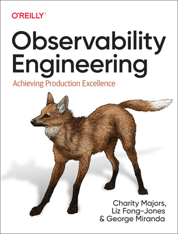

For the first book review in what I will call my *coffee reads* section of the blog I will be reviewing the book [Observability Engineering: Achieving Production Excellence](https://www.oreilly.com/library/view/observability-engineering/9781492050046/).

## Observability Engineering: Achieving Production Excellence

The book, in its own description, sets out to be an advocate for the adoption of observability practices in the software industry. Written by Charity Majors, Liz Fong-Jones, and George Miranda from [Honeycomb.io](https://www.honeycomb.io/), the book aims to be a resource for anyone interested in learning more about what is good observability, how you can build on top of your system today, and how to implement it in your organization.

The book, consisting of around 400 pages, is split into 3 main parts: the first part is an introduction to observability, the second part is a deep dive into the different observability tools and practices, and the third part is a guide on how to implement observability in your organization.

## Thoughts on the book

I bought this book for Kindle and went into it with basic knowledge about observability and having used the Honeycomb product a bit for work. 

My expectations from the title and the summary of the book were to learn about the different tools and practices in the realm of observability in addition to getting a better understanding of the theory behind observability and how it can be implemented in an organization.

### Highlights
The introduction to observability section was a very high-level overview of what observability is and how it differs from monitoring.

I appreciated the change in mentality the book triggered in me around the concept of observability versus the concept of monitoring. The book did a very good job of explaining how observability has a more holistic approach than monitoring. I could relate to the examples given in the book about how monitoring is a reactive approach to problems and how observability is a proactive approach to problems and all the frustrations that came from relying solely on monitoring such as excessive alerting, false positives, and the lack of context, excessive use of dashboards, and the lack of understanding of the system.

The book did not focus solely on the tools that Honeycomb uses and tried to offer an overview of what the market offers for this goal it did a good job at explaining the different tools and practices in terms of observability. The section on _*tracing*_ explains how tracing works and how it can be used to understand the flow of a request through a system in great detail with examples and code snippets. I found it easy to follow and because of this, I understood what benefits it brings and how it can be used. The section on _*metrics*_ was also very useful in explaining how you can understand the health of a system by using metrics and how you can also make use of them to detect any system anomalies.

The main key takeaway from this chapter was that by using observability concepts and tooling correctly you don't need to rely on software engineers to understand the system, you can use the data, that is available for everyone, to understand the system and make decisions based on the data. 

The book also emphasizes the organizational and cultural changes that need to be made to implement observability in an organization. As an example, the book explains how the concept of blameless postmortems is a good way to encourage a culture of learning and how it can be used to improve the system. How if you rely on data then all the software engineers with a hero complex will have to adapt. I had a lot of respect for the authors for being honest about these points and for highlighting the day-to-day realities of implementing observability in an organization.

The idea of adding case studies of companies that have implemented observability in their organization was very nice and I enjoyed reading about how different companies went about adopting observability practices and the challenges they needed to address.

### Areas for Improvement

Onto the things that I think could be revisited in the next versions of the book.

There is a bit of repetition in the book, especially in the first part, where the same concepts are explained in different ways and the same idea, the difference between observability and monitoring, is reiterated several times. Definitely, this could be reduced in the next version of the book.

The book also does not go into implementation details on how observability can _actually_ be adopted. It reiterates the challenges but is a bit succinct on how to address them. And the same for implementing observability practices in your system.

Some sections had a lot of detailed code snippets which were hard to read. I skimmed over them to get the gist while in other sections I would have liked to see more code snippets to help me understand the concepts better.

The case study section was too high level for my liking. I would've loved to read more about the _challenges_ they faced and _how_ they addressed them, rather than mention team collaboration as being the success metric in adopting observability. Go into detail about the tools they used and how they used them. What their lessons learned were.

So because of this, the book felt a bit unbalanced at times in my opinion.

## Summary

To summarize, the book, I would say, had a lot of good key takeaways to set you on the path to adopting observability practices either in your day-to-day work or team level or maybe even organizational level, but it did fell short in some areas. Nevertheless, it was a good read and I would recommend it to anyone interested in learning more about observability. 

If you've read the book let me know what you thought about it in the comments below. Or if you have any recommendations for other books on the topic of observability I would love to hear them.

Enjoy your coffee!
