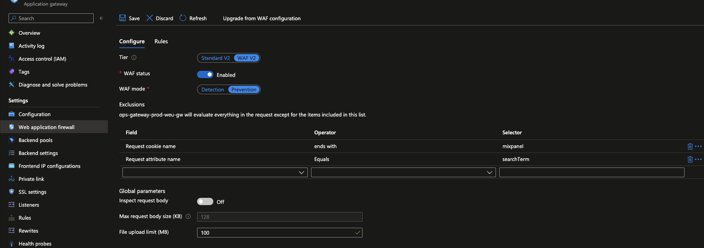
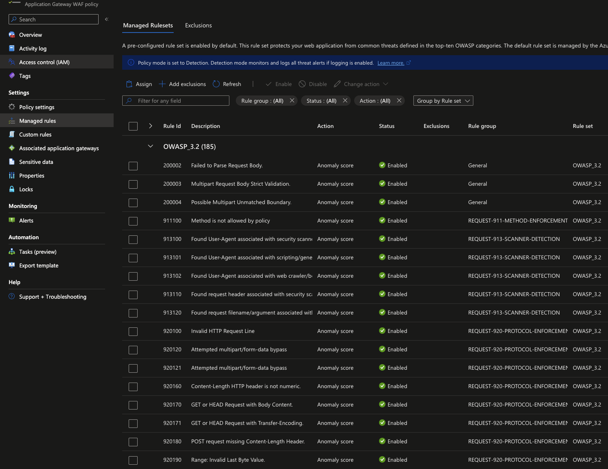
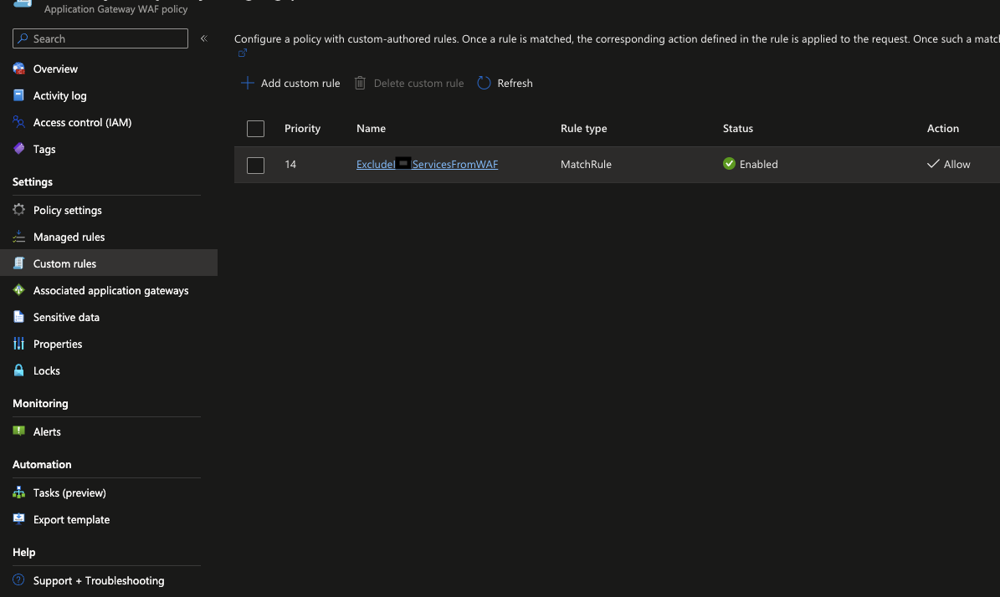
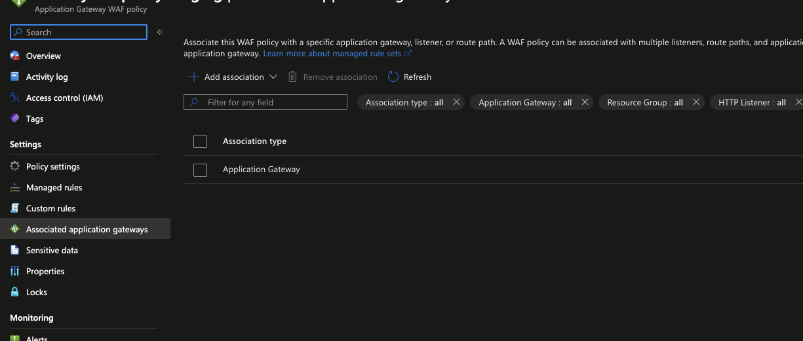
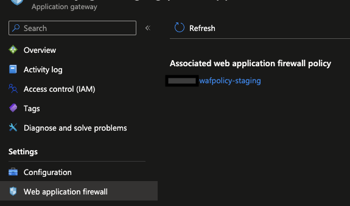

Recently, I had to enable WAF on our Azure Application Gateway. Because of our infrastructure setup, I wanted to have all the rules from OWASP 3.2 enabled, but I needed to be able to exclude some of our (valid) requests from being blocked as well. To achieve this, I could either try to configure the WAF Config section on our Gateway or create a WAF policy. 

Given that it was not entirely clear how you can use proper exclusions and filters based on what you need, I decided to write this post to explain the differences I found between the two and how you can use them.

## What is WAF?
To recap what Web Application Firewall (WAF) is, here is a brief explanation from the official documentation:

> Azure Web Application Firewall (WAF) on Azure Application Gateway provides centralized protection of your web applications from common exploits and vulnerabilities. Web applications are increasingly targeted by malicious attacks that exploit commonly known vulnerabilities. SQL injection and cross-site scripting are among the most common attacks.

> WAF on Application Gateway is based on the Core Rule Set (CRS) from the Open Web Application Security Project (OWASP).

Before being able to enable and benefit from WAF capabilities, you will need to check the **SKU** of the Application Gateway you have. WAF can only be enabled on the **WAF_v2** SKU and not the Standard SKU. As this was my case as well, I first had to change the SKU of the Application Gateway. This can be done either from the Azure Portal or using Terraform (or any other tool for IaC, in my case, I used this one). 

After this, you can proceed with configuring WAF. This can be done in two ways: either using the built-in __WAF Config section__ of the Application Gateway or creating a __WAF policy__ for the Azure Application Gateway.

Let's look at what each one is and how you can use them.

## WAF config
The WAF config section is a built-in part of the Application Gateway configuration as can be seen in the image below:



WAF Config is the Application Gateway's built-in method to configure WAF and it is the section where you can add your configurations such as exclusions or custom rules.

When using Terraform you can find the `waf_configuration` block under the `azurerm_application_gateway` [resource](https://registry.terraform.io/providers/hashicorp/azurerm/latest/docs/resources/application_gateway#waf_configuration).

Let's look at an example of how you can configure it using Terraform. 

_Scenario:_ I would like to configure it to use OWASP 3.2 rules, enable the WAF, and exclude some of our telemetry requests from being blocked while also disabling some rules. This is how the basic configuration would look like:

```hcl
resource "azurerm_application_gateway" "application_gateway" {
  (...)
  "waf_configuration" {
    enabled                  = true
    firewall_mode            = "Prevention"
    rule_set_type            = "OWASP"
    rule_set_version         = "3.2"
    file_upload_limit_mb     = 100
    max_request_body_size_kb = 128
    request_body_check       = false

    exclusion {
        match_variable          = "RequestCookieNames"
        selector                = "telemetry"
        selector_match_operator = "Contains"
    }

    disabled_rule_group {
    rule_group_name = "REQUEST-920-PROTOCOL-ENFORCEMENT"
    rules = [
      920230,
      920320,
      ]
    }

    disabled_rule_group {
      rule_group_name = "REQUEST-921-PROTOCOL-ATTACK"
      rules = [
        921180,
        921170,
      ]
    }
  }
}
```

The scenario was simple and while the configuration itself is not hard to do, there are a few **drawbacks** to using it:

- it does not allow you to add _custom rules_ from the Azure Portal UI. This means that if you want to add a custom rule, you will have to do it using the Azure CLI (or PowerShell). I would like to ideally have all my configurations in one place and not have to use multiple tools to configure or maintain my resources.

- if you have multiple Application Gateways, you will have to configure each one of them separately. Because WAF Config is built-in the Application Gateway this also means it is _managed locally to that specific Application Gateway_. While it's configuration applies to everything in the Azure Application Gateway resource. Which was my case as well as I don't manage just one Application Gateway.

- if you are working with Azure Front Door it's good to know that you cannot use WAF Config in that context. This is because _Azure Front Door does not support WAF Config._

## WAF policy

As opposed to WAF Config, which is a built-in functionality in the Application Gateway, WAF policies are a __standalone resource__ that enables you to configure WAF. This means that you can create a WAF policy and then apply it to multiple Application Gateways or even Azure Front Door resources as well.

WAF policy allows you to have a __centralized configuration__ for all your WAF resources. This means that you can have the same configuration for all your WAF resources and you can also have a __single place__ where you can manage your WAF configuration.

Because it is a standalone resource the first benefit is you will be able to find all the configurations necessary in the Azure Portal UI: TODO: Rephrase

You have your Managed rules:



Your Custom rules:



And your associated gateways:



As you can already guess from the screenshots, WAF Policy gives you a bit more control over your configuration as you can be more detailed in what you want to exclude or include in your rules.

You have the flexibility to link a WAF (Web Application Firewall) policy in various ways: you can connect it:
- **globally** by assigning it to an Azure Application Gateway resource
- **per-site** level by linking it to a listener
- **per URI** level by associating it with a particular route path

For more details (and examples) on how you can link a WAF policy to your resources, you can check the official documentation [here](https://learn.microsoft.com/en-us/azure/web-application-firewall/ag/policy-overview).

In Terraform this means you will need to create a new resource:

```hcl
resource "azurerm_web_application_firewall_policy" "waf_policy" {
  name                = "wafpolicy"
  resource_group_name = azurerm_resource_group.rg.name
  location            = azurerm_resource_group.rg.location

  policy_settings {
    enabled                     = true
    mode                        = "Prevention"
    request_body_check          = false
    file_upload_limit_in_mb     = 100
    max_request_body_size_in_kb = 128
  }

  ## Example of managed rules
  managed_rules {
    managed_rule_set {
      type    = "OWASP"
      version = "3.2"
      rule_group_override {
        rule_group_name = "REQUEST-920-PROTOCOL-ENFORCEMENT"
        disabled_rules = [
          920200,
          920201,
          920202
        ]
      }

      rule_group_override {
        rule_group_name = "REQUEST-921-PROTOCOL-ATTACK"
        disabled_rules = [
          921170,
          921180,
        ]
      }

      rule_group_override {
        rule_group_name = "REQUEST-942-APPLICATION-ATTACK-SQLI"
        disabled_rules = [
          942430
        ]
      }
    }
  }

  ## Example of custom rules
  custom_rules {
    name      = "ExcludeServicesFromWAF"
    priority  = 14
    rule_type = "MatchRule"

    match_conditions {
      match_variables {
        variable_name = "RequestUri"
      }

      operator           = "Contains"
      negation_condition = false
      match_values = [
        "/service1/",
      (...)
      ]
    }

    action = "Allow"
  }
}

```

After creating the WAF Policy you will need to associate it to the Application Gateway which will be done by adding the following parameters to the `azurerm_application_gateway` resource:

```hcl
  firewall_policy_id                = azurerm_web_application_firewall_policy.wafpolicy.id
  force_firewall_policy_association = true
```

The first thing you will notice, if you go to Azure Portal, is that in your Application Gatway resource you will no longer have the WAF Config section available, but a link to the WAF Policy you just created:



This means that any change you want to make to your WAF configuration you will need to do it in the WAF Policy resource itself and not in the Application Gateway resource.
This offered me the granularity I needed to be able to exclude the requests I wanted and also have the same configuration for all my Application Gateways.

In my case, WAF Config was not the right answer for what I needed: have the same exclusions on all our gateways and also have the same custom rules regradless of environment and allow me to exclude the requests that were coming from our services. 
This is why I decided to look into WAF policies instead.

## Final thoughts

WAF Config is a good option if you want to configure WAF settings at Application Gateway level that applies to all the listeners and rules within it. It's quite suitable if you have a single set of WAF settings that you want to apply to all your web applications behind the Application Gateway.

Whereas, WAF Policy will be a good choice when you need to have a more granular control over your WAF settings, where you need to define custom WAF settings and rules per-application or per-bath basis. One use-case for this could be if you have several applications behind the Application Gateway that have different security concerns and require configuring different WAF settings.

I did not dive into all the rules and settings you can configure for WAF, which will be the topic of a separate more in-depth article, but I hope this post will help you decide which one is the best option for you.

_Thank you for reading and hope this helps somebody else!_
