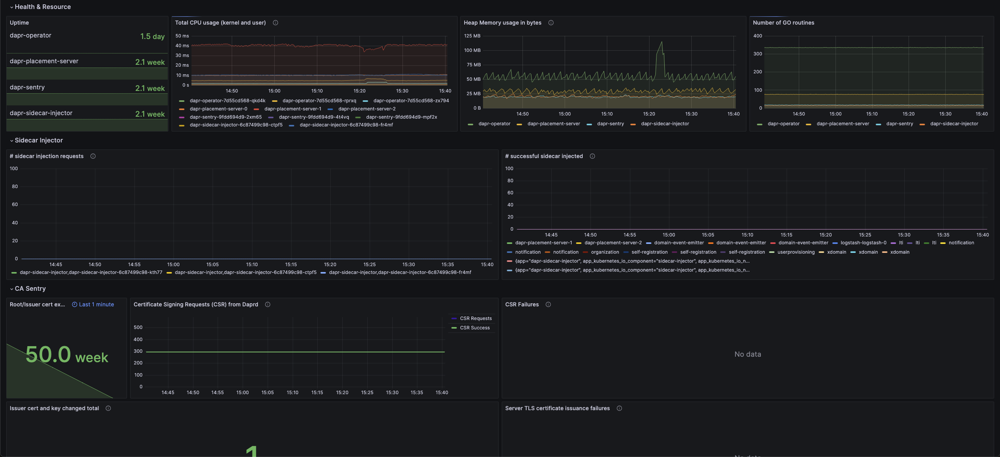
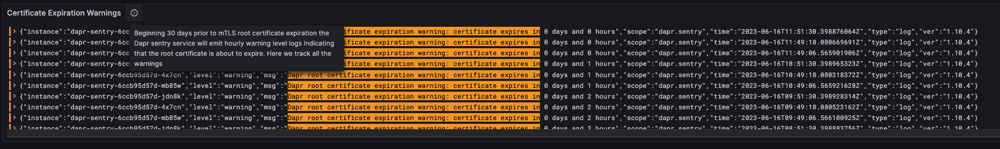

A CNCF project, the [Distributed Application Runtime (Dapr)](https://dapr.io/) provides APIs that simplify microservice connectivity. Whether your communication pattern is service to service invocation or pub/sub messaging, Dapr helps you write resilient and secured microservices. Essentially, it provides a new way to build microservices by using the reusable blocks implemented as  sidecars.

While Dapr is great as it is language agnostic and it solves some challenges that come with microservices and distributed systems, such as message broker integration, encryption etc, troubleshooting Dapr issues can be quite challenging. Dapr logs, especially the error messages, can be quite generic and sometimes do not provide enough information for you to understand what is going on.

In this blog post, I want to detail a problem I had with Dapr certificate expiration, how I troubleshoot the root cause, the symptoms the application was manifesting and how I managed to solve it.

I want also to highlight how important it is to have proper monitoring in place so I will be touching upon that as well by showing you some lessons learned and what I ended setting up to save me from repeating the same mistakes in the future.

## Symptoms

Application deployment was failing because it could not inject the dapr sidecar. It kept restarting until reaching the 5min defaut timeout and rolledback. Checking the events on the pod I noticed the `GET /healthz` endpoints for liveness and readiness probes were throwing `connect: connection refused`.

There were no errors in app logs or in the Dapr sidecar logs. The only thing I noticed was that the dapr sidecar was in `CrashLoopBackOff` state.

## Troubleshooting
### _Step 1_: **Dapr Operator** logs

Since no longs were available on pod or Dapr sidecar, I started by checking the logs of the next best thing which was the **Dapr Operator** and I noticed the following error:

```bash
{"instance":"dapr-operator-0000000000-abcd","level":"info","msg":"starting webhooks","scope":"dapr.operator","time":"2023-05-25T12:51:13.267369255Z","type":"log","ver":"1.10.4"}
I0525 12:51:13.269285       1 leaderelection.go:248] attempting to acquire leader lease dapr-system/webhooks.dapr.io...
{"instance":"dapr-operator-0000000000-abcd","level":"info","msg":"Conversion webhook for \"subscriptions.dapr.io\" is up to date","scope":"dapr.operator","time":"2023-05-25T12:51:13.277615379Z","type":"log","ver":"1.10.4"}
W0601 02:52:46.530879       1 reflector.go:347] pkg/mod/k8s.io/client-go@v0.26.1/tools/cache/reflector.go:169: watch of *v1.Secret ended with: an error on the server ("unable to decode an event from the watch stream: http2: client connection lost") has prevented the request from succeeding
W0601 02:52:46.531001       1 reflector.go:347] pkg/mod/k8s.io/client-go@v0.26.1/tools/cache/reflector.go:169: watch of *v1alpha1.Configuration ended with: an error on the server ("unable to decode an event from the watch stream: http2: client connection lost") has prevented the request from succeeding
W0601 02:52:46.531061       1 reflector.go:347] pkg/mod/k8s.io/client-go@v0.26.1/tools/cache/reflector.go:169: watch of *v1.Service ended with: an error on the server ("unable to decode an event from the watch stream: http2: client connection lost") has prevented the request from succeeding
E0601 02:52:46.531050       1 leaderelection.go:330] error retrieving resource lock dapr-system/operator.dapr.io: Get "https://X.X.X.X:443/apis/coordination.k8s.io/v1/namespaces/dapr-system/leases/operator.dapr.io": http2: client connection lost
W0601 02:52:46.531095       1 reflector.go:347] pkg/mod/k8s.io/client-go@v0.26.1/tools/cache/reflector.go:169: watch of *v1alpha1.Resiliency ended with: an error on the server ("unable to decode an event from the watch stream: http2: client connection lost") has prevented the request from succeeding
W0601 02:52:46.530891       1 reflector.go:347] pkg/mod/k8s.io/client-go@v0.26.1/tools/cache/reflector.go:169: watch of *v1alpha1.Component ended with: an error on the server ("unable to decode an event from the watch stream: http2: client connection lost") has prevented the request from succeeding
E0601 02:52:46.531191       1 leaderelection.go:330] error retrieving resource lock dapr-system/webhooks.dapr.io: Get "https://X.X.X.X:443/apis/coordination.k8s.io/v1/namespaces/dapr-system/leases/webhooks.dapr.io": http2: client connection lost
```

The Dapr operator works by establishing an admission webhook, which enables Kubernetes (K8s) to interact with it when it intends to deploy a new pod. After a successful response, the daprd container is added to the pod. For more in detail information on how the operator works, check the [Dapr Operator control plane service overview documentation](https://docs.dapr.io/concepts/dapr-services/operator/).

### _Step 2_: Investigate the `http2: client connection lost` error

The `http2: client connection lost` error indicated to me that K8s could not successfully invoke the admission webhook, so I started to check one by one:

**Network connectivity**: The error message mentioned a potential issue with the client connection being lost. So I verified that the machine running the Dapr process could establish a stable connection to the Kubernetes API server. Checked for any network connectivity issues or firewalls that might be interfering with the communication. Everything was fine.

**API server issues**: I also checked for any issues with the Kubernetes API server itself, such as high load, resource constraints, or misconfiguration. No issues found.

**Namespace or resource deletion**: I checked that no resources had been deleted in the the dapr-system namespace or the webhooks.dapr.io resource. Everything was still there.

### _Step 3_: **AKS cluster** logs

So as next step, I started looking into the **AKS cluster logs** and noticed that all the services that were also using Dapr had the following error `authentication handshake failed`. The full log is below:

```bash	
{"app_id":"app1","instance":"app1-123456-abc7","level":"info","msg":"sending workload csr request to sentry","scope":"dapr.runtime.grpc.internal","time":"2023-06-19T13:19:53.535345802Z","type":"log","ver":"1.10.4"}
2023-06-19 15:19:53.535	
{"app_id":"app1","instance":"app1-123456-abc7","level":"info","msg":"renewing certificate: requesting new cert and restarting gRPC server","scope":"dapr.runtime.grpc.internal","time":"2023-06-19T13:19:53.535329702Z","type":"log","ver":"1.10.4"}
2023-06-19 15:19:53.535	
{"app_id":"app1","instance":"app1-123456-abc7","level":"error","msg":"error starting server: error from authenticator CreateSignedWorkloadCert: error from sentry SignCertificate: rpc error: code = Unavailable desc = connection error: desc = \"transport: authentication handshake failed: tls: failed to verify certificate: x509: certificate has expired or is not yet valid: current time 2023-06-19T13:19:51Z is after 2023-06-16T12:31:17Z\"","scope":"dapr.runtime.grpc.internal","time":"2023-06-19T13:19:53.535259601Z","type":"log","ver":"1.10.4"}
```

The errors above were a confirmation that it could not establish a connection because it could not authenticate due to an handshake failure.


### _Step 4_: *Dapr Sentry* logs

To dig deeper, I researched how Dapr handles mTLS which pointed me to the Dapr Sentry service.

> The Dapr Sentry service manages mTLS between services and acts as a certificate authority. It generates mTLS certificates and distributes them to any running sidecars. This allows sidecars to communicate with encrypted, mTLS traffic.

So I went to check the *Dapr Sentry* logs and I finally found the issue: **Dapr root certificate expired**.

```bash
2023-06-19 14:49:06.566	
{"instance":"dapr-sentry-123456-abc7","level":"warning","msg":"Dapr root certificate expiration warning: certificate has expired.","scope":"dapr.sentry","time":"2023-06-19T12:49:06.566339341Z","type":"log","ver":"1.10.4"} 
```

In order to view the logs of the Dapr Sentry service you can run the following command:

```bash
kubectl logs --selector=app=dapr-sentry --namespace <NAMESPACE>
```

## Generating a new root certificate

By default, the certificate expires after 365 days. You can change the expiration time by setting the `--cert-chain-expiration` flag when you start the Dapr Sentry service. The value is in days.

With Dapr, you can encrypt communication between applications using self-signed one valid for 1 year so it was time to renew the certificate.

To renew the certificate, I followed the recommended steps to root and issuer certificate upgrade using CLI. You can find the steps [here](https://docs.dapr.io/operations/security/mtls/#root-and-issuer-certificate-upgrade-using-cli-recommended).

1. Generated brand new root and issuer certificates, signed by a newly generated private root key by running the following command:

```bash
dapr mtls renew-certificate -k --valid-until <days> --restart
```
```bash                                                                              
⌛  Starting certificate rotation
ℹ️  generating fresh certificates
ℹ️  Updating certifcates in your Kubernetes cluster
ℹ️  Dapr control plane version 1.10.4 detected in namespace dapr-system
✅  Certificate rotation is successful! Your new certicate is valid through Wed, 18 Jun 2025 13:37:30 UTC
ℹ️  Restarting deploy/dapr-sentry..
ℹ️  Restarting deploy/dapr-operator..
ℹ️  Restarting statefulsets/dapr-placement-server..
✅  All control plane services have restarted successfully!
```
2. Restarted one of the applications in kubernetes to see if the changes worked successfully. And it did!

3. Redeployed all applications that were using Dapr via our normal Github Actions pipelines.

There was no downtime and the process was quite smooth. Dapr does not renew certificates automatically so depending on your setup you will need to renew them manually or create an intermediary service that does it for you.

## Next steps

### Lesson learned no 1: Have an overview of your Dapr services

I had no overview of the Dapr system which caused me a lot of time in trying to get to the root cause. So first thing I did was to create a **nice dashboard** where we can have an overview of our Dapr services and their certificates. I started from the official one from [Grafana](https://github.com/dapr/dapr/tree/master/grafana) for this. But the dashboard is a bit outdated so I had some issues with the queries, so I did some changes and you can find the JSON of the dashboard below if it helps anyone.


```json
{
  "annotations": {
    "list": [
      {
        "builtIn": 1,
        "datasource": {
          "type": "prometheus",
          "uid": "${monitoring_datasource_name}"
        },
        "enable": true,
        "hide": true,
        "iconColor": "rgba(0, 211, 255, 1)",
        "name": "Annotations & Alerts",
        "target": {
          "limit": 100,
          "matchAny": false,
          "tags": [],
          "type": "dashboard"
        },
        "type": "dashboard"
      }
    ]
  },
  "description": "This dashboard shows the metrics of Dapr control plane services",
  "editable": true,
  "fiscalYearStartMonth": 0,
  "graphTooltip": 0,
  "id": 210,
  "links": [],
  "liveNow": false,
  "panels": [
    {
      "collapsed": false,
      "datasource": {
        "type": "grafana-azure-monitor-datasource",
        "uid": "000000006"
      },
      "gridPos": {
        "h": 1,
        "w": 24,
        "x": 0,
        "y": 0
      },
      "id": 18,
      "panels": [],
      "targets": [
        {
          "datasource": {
            "type": "grafana-azure-monitor-datasource",
            "uid": "000000006"
          },
          "refId": "A"
        }
      ],
      "title": "Health & Resource",
      "type": "row"
    },
    {
      "datasource": {
        "type": "prometheus",
        "uid": "${monitoring_datasource_name}"
      },
      "fieldConfig": {
        "defaults": {
          "decimals": 1,
          "mappings": [
            {
              "options": {
                "match": "null",
                "result": {
                  "text": "N/A"
                }
              },
              "type": "special"
            }
          ],
          "thresholds": {
            "mode": "absolute",
            "steps": [
              {
                "color": "red",
                "value": null
              },
              {
                "color": "green",
                "value": 600
              }
            ]
          },
          "unit": "s"
        },
        "overrides": []
      },
      "gridPos": {
        "h": 8,
        "w": 4,
        "x": 0,
        "y": 1
      },
      "id": 20,
      "links": [],
      "options": {
        "colorMode": "value",
        "graphMode": "area",
        "justifyMode": "auto",
        "orientation": "horizontal",
        "reduceOptions": {
          "calcs": [
            "last"
          ],
          "fields": "",
          "values": false
        },
        "textMode": "auto"
      },
      "pluginVersion": "10.0.2-cloud.1.94a6f396",
      "targets": [
        {
          "datasource": {
            "type": "prometheus",
            "uid": "${monitoring_datasource_name}"
          },
          "editorMode": "code",
          "expr": "time() - max(process_start_time_seconds{app=~\"dapr-sentry|dapr-placement-server|dapr-sidecar-injector|dapr-operator\", cluster=\"$cluster\"}) by (app)",
          "instant": false,
          "legendFormat": "{{app}}",
          "range": true,
          "refId": "A"
        }
      ],
      "title": "Uptime",
      "type": "stat"
    },
    {
      "aliasColors": {},
      "bars": false,
      "dashLength": 10,
      "dashes": false,
      "datasource": {
        "type": "prometheus",
        "uid": "${monitoring_datasource_name}"
      },
      "description": "This shows total amount of kernel and user CPU usage time.",
      "fieldConfig": {
        "defaults": {
          "links": []
        },
        "overrides": []
      },
      "fill": 1,
      "fillGradient": 0,
      "gridPos": {
        "h": 8,
        "w": 7,
        "x": 4,
        "y": 1
      },
      "hiddenSeries": false,
      "id": 22,
      "legend": {
        "avg": false,
        "current": false,
        "max": false,
        "min": false,
        "show": true,
        "total": false,
        "values": false
      },
      "lines": true,
      "linewidth": 1,
      "nullPointMode": "null",
      "options": {
        "alertThreshold": true
      },
      "percentage": false,
      "pluginVersion": "10.0.2-cloud.1.94a6f396",
      "pointradius": 2,
      "points": false,
      "renderer": "flot",
      "seriesOverrides": [],
      "spaceLength": 10,
      "stack": false,
      "steppedLine": false,
      "targets": [
        {
          "datasource": {
            "type": "prometheus",
            "uid": "${monitoring_datasource_name}"
          },
          "editorMode": "code",
          "expr": "sum(rate(container_cpu_usage_seconds_total{pod=~\"(dapr-sentry|dapr-sidecar-injector|dapr-placement-server|dapr-operator).*\", cluster=\"$cluster\"}[5m])) by (pod)",
          "instant": false,
          "legendFormat": "{{app}}",
          "range": true,
          "refId": "A"
        }
      ],
      "thresholds": [],
      "timeRegions": [],
      "title": "Total CPU usage (kernel and user)",
      "tooltip": {
        "shared": true,
        "sort": 0,
        "value_type": "individual"
      },
      "type": "graph",
      "xaxis": {
        "mode": "time",
        "show": true,
        "values": []
      },
      "yaxes": [
        {
          "format": "s",
          "logBase": 1,
          "show": true
        },
        {
          "format": "short",
          "logBase": 1,
          "show": true
        }
      ],
      "yaxis": {
        "align": false
      }
    },
    {
      "aliasColors": {},
      "bars": false,
      "dashLength": 10,
      "dashes": false,
      "datasource": {
        "type": "prometheus",
        "uid": "${monitoring_datasource_name}"
      },
      "description": "The amount of allocated heap memory that belongs specifically to that process in bytes.",
      "fieldConfig": {
        "defaults": {
          "links": []
        },
        "overrides": []
      },
      "fill": 1,
      "fillGradient": 0,
      "gridPos": {
        "h": 8,
        "w": 7,
        "x": 11,
        "y": 1
      },
      "hiddenSeries": false,
      "id": 24,
      "legend": {
        "avg": false,
        "current": false,
        "max": false,
        "min": false,
        "show": true,
        "total": false,
        "values": false
      },
      "lines": true,
      "linewidth": 1,
      "nullPointMode": "null",
      "options": {
        "alertThreshold": true
      },
      "percentage": false,
      "pluginVersion": "10.0.2-cloud.1.94a6f396",
      "pointradius": 2,
      "points": false,
      "renderer": "flot",
      "seriesOverrides": [],
      "spaceLength": 10,
      "stack": false,
      "steppedLine": false,
      "targets": [
        {
          "datasource": {
            "type": "prometheus",
            "uid": "${monitoring_datasource_name}"
          },
          "editorMode": "code",
          "expr": "sum(go_memstats_alloc_bytes{app=~\"(dapr-sentry|dapr-sidecar-injector|dapr-placement-server|dapr-operator)\",cluster=\"$cluster\"}) by (app)",
          "instant": false,
          "legendFormat": "{{app}}",
          "range": true,
          "refId": "A"
        }
      ],
      "thresholds": [],
      "timeRegions": [],
      "title": "Heap Memory usage in bytes",
      "tooltip": {
        "shared": true,
        "sort": 0,
        "value_type": "individual"
      },
      "type": "graph",
      "xaxis": {
        "mode": "time",
        "show": true,
        "values": []
      },
      "yaxes": [
        {
          "format": "decbytes",
          "logBase": 1,
          "show": true
        },
        {
          "format": "short",
          "logBase": 1,
          "show": true
        }
      ],
      "yaxis": {
        "align": false
      }
    },
    {
      "aliasColors": {},
      "bars": false,
      "dashLength": 10,
      "dashes": false,
      "datasource": {
        "type": "prometheus",
        "uid": "${monitoring_datasource_name}"
      },
      "fieldConfig": {
        "defaults": {
          "links": []
        },
        "overrides": []
      },
      "fill": 1,
      "fillGradient": 0,
      "gridPos": {
        "h": 8,
        "w": 6,
        "x": 18,
        "y": 1
      },
      "hiddenSeries": false,
      "id": 26,
      "legend": {
        "avg": false,
        "current": false,
        "max": false,
        "min": false,
        "show": true,
        "total": false,
        "values": false
      },
      "lines": true,
      "linewidth": 1,
      "nullPointMode": "null",
      "options": {
        "alertThreshold": true
      },
      "percentage": false,
      "pluginVersion": "10.0.2-cloud.1.94a6f396",
      "pointradius": 2,
      "points": false,
      "renderer": "flot",
      "seriesOverrides": [],
      "spaceLength": 10,
      "stack": false,
      "steppedLine": false,
      "targets": [
        {
          "datasource": {
            "type": "prometheus",
            "uid": "${monitoring_datasource_name}"
          },
          "editorMode": "code",
          "expr": "max(go_goroutines{app=~\"(dapr-sentry|dapr-sidecar-injector|dapr-placement-server|dapr-operator)\",cluster=\"$cluster\"}) by (app)",
          "instant": false,
          "legendFormat": "{{app}}",
          "range": true,
          "refId": "A"
        }
      ],
      "thresholds": [],
      "timeRegions": [],
      "title": "Number of GO routines",
      "tooltip": {
        "shared": true,
        "sort": 0,
        "value_type": "individual"
      },
      "type": "graph",
      "xaxis": {
        "mode": "time",
        "show": true,
        "values": []
      },
      "yaxes": [
        {
          "format": "short",
          "logBase": 1,
          "show": true
        },
        {
          "format": "short",
          "logBase": 1,
          "show": true
        }
      ],
      "yaxis": {
        "align": false
      }
    },
    {
      "collapsed": false,
      "datasource": {
        "type": "grafana-azure-monitor-datasource",
        "uid": "000000006"
      },
      "gridPos": {
        "h": 1,
        "w": 24,
        "x": 0,
        "y": 9
      },
      "id": 12,
      "panels": [],
      "targets": [
        {
          "datasource": {
            "type": "grafana-azure-monitor-datasource",
            "uid": "000000006"
          },
          "refId": "A"
        }
      ],
      "title": "Sidecar Injector",
      "type": "row"
    },
    {
      "datasource": {
        "type": "prometheus",
        "uid": "${monitoring_datasource_name}"
      },
      "description": "The total number of sidecar injection requests.",
      "fieldConfig": {
        "defaults": {
          "color": {
            "mode": "palette-classic"
          },
          "custom": {
            "axisCenteredZero": false,
            "axisColorMode": "text",
            "axisLabel": "",
            "axisPlacement": "auto",
            "barAlignment": 0,
            "drawStyle": "line",
            "fillOpacity": 10,
            "gradientMode": "none",
            "hideFrom": {
              "legend": false,
              "tooltip": false,
              "viz": false
            },
            "lineInterpolation": "linear",
            "lineWidth": 1,
            "pointSize": 5,
            "scaleDistribution": {
              "type": "linear"
            },
            "showPoints": "never",
            "spanNulls": false,
            "stacking": {
              "group": "A",
              "mode": "none"
            },
            "thresholdsStyle": {
              "mode": "off"
            }
          },
          "links": [],
          "mappings": [],
          "thresholds": {
            "mode": "absolute",
            "steps": [
              {
                "color": "green",
                "value": null
              },
              {
                "color": "red",
                "value": 80
              }
            ]
          },
          "unit": "short"
        },
        "overrides": []
      },
      "gridPos": {
        "h": 9,
        "w": 12,
        "x": 0,
        "y": 10
      },
      "id": 8,
      "options": {
        "legend": {
          "calcs": [],
          "displayMode": "list",
          "placement": "bottom",
          "showLegend": true
        },
        "tooltip": {
          "mode": "multi",
          "sort": "none"
        }
      },
      "pluginVersion": "10.0.1-cloud.3.f250259e",
      "targets": [
        {
          "datasource": {
            "type": "prometheus",
            "uid": "${monitoring_datasource_name}"
          },
          "editorMode": "code",
          "exemplar": false,
          "expr": "rate(dapr_injector_sidecar_injection_requests_total{cluster=\"$cluster\"}[5m])",
          "instant": false,
          "interval": "",
          "legendFormat": "{{app}},{{pod}}",
          "range": true,
          "refId": "A"
        }
      ],
      "title": "# sidecar injection requests",
      "type": "timeseries"
    },
    {
      "datasource": {
        "type": "prometheus",
        "uid": "${monitoring_datasource_name}"
      },
      "description": "The total number of successful sidecar injection requests.",
      "fieldConfig": {
        "defaults": {
          "color": {
            "mode": "palette-classic"
          },
          "custom": {
            "axisCenteredZero": false,
            "axisColorMode": "text",
            "axisLabel": "",
            "axisPlacement": "auto",
            "barAlignment": 0,
            "drawStyle": "line",
            "fillOpacity": 10,
            "gradientMode": "none",
            "hideFrom": {
              "legend": false,
              "tooltip": false,
              "viz": false
            },
            "lineInterpolation": "linear",
            "lineWidth": 1,
            "pointSize": 5,
            "scaleDistribution": {
              "type": "linear"
            },
            "showPoints": "never",
            "spanNulls": false,
            "stacking": {
              "group": "A",
              "mode": "none"
            },
            "thresholdsStyle": {
              "mode": "off"
            }
          },
          "links": [],
          "mappings": [],
          "thresholds": {
            "mode": "absolute",
            "steps": [
              {
                "color": "green",
                "value": null
              },
              {
                "color": "red",
                "value": 80
              }
            ]
          },
          "unit": "short"
        },
        "overrides": []
      },
      "gridPos": {
        "h": 9,
        "w": 12,
        "x": 12,
        "y": 10
      },
      "id": 10,
      "options": {
        "legend": {
          "calcs": [],
          "displayMode": "list",
          "placement": "bottom",
          "showLegend": true
        },
        "tooltip": {
          "mode": "multi",
          "sort": "none"
        }
      },
      "pluginVersion": "10.0.1-cloud.3.f250259e",
      "targets": [
        {
          "datasource": {
            "type": "prometheus",
            "uid": "${monitoring_datasource_name}"
          },
          "editorMode": "code",
          "expr": "rate(dapr_injector_sidecar_injection_succeeded_total{cluster=\"$cluster\"}[5m])",
          "instant": false,
          "legendFormat": "{{app_id}}",
          "range": true,
          "refId": "A"
        }
      ],
      "title": "# successful sidecar injected",
      "type": "timeseries"
    },
    {
      "collapsed": false,
      "datasource": {
        "type": "grafana-azure-monitor-datasource",
        "uid": "000000006"
      },
      "gridPos": {
        "h": 1,
        "w": 24,
        "x": 0,
        "y": 19
      },
      "id": 42,
      "panels": [],
      "targets": [
        {
          "datasource": {
            "type": "grafana-azure-monitor-datasource",
            "uid": "000000006"
          },
          "refId": "A"
        }
      ],
      "title": "CA Sentry",
      "type": "row"
    },
    {
      "datasource": {
        "type": "prometheus",
        "uid": "${monitoring_datasource_name}"
      },
      "description": "",
      "fieldConfig": {
        "defaults": {
          "color": {
            "mode": "thresholds"
          },
          "mappings": [
            {
              "options": {
                "match": "null",
                "result": {
                  "text": "N/A"
                }
              },
              "type": "special"
            }
          ],
          "thresholds": {
            "mode": "absolute",
            "steps": [
              {
                "color": "#F2495C",
                "value": null
              },
              {
                "color": "#FADE2A",
                "value": 2628000
              },
              {
                "color": "#73BF69",
                "value": 5256000
              }
            ]
          },
          "unit": "s"
        },
        "overrides": []
      },
      "gridPos": {
        "h": 7,
        "w": 3,
        "x": 0,
        "y": 20
      },
      "id": 44,
      "links": [],
      "maxDataPoints": 100,
      "options": {
        "colorMode": "value",
        "graphMode": "area",
        "justifyMode": "auto",
        "orientation": "horizontal",
        "reduceOptions": {
          "calcs": [
            "lastNotNull"
          ],
          "fields": "",
          "values": false
        },
        "textMode": "auto"
      },
      "pluginVersion": "10.0.2-cloud.1.94a6f396",
      "targets": [
        {
          "datasource": {
            "type": "prometheus",
            "uid": "${monitoring_datasource_name}"
          },
          "editorMode": "code",
          "expr": "min(dapr_sentry_issuercert_expiry_timestamp) - time()",
          "instant": false,
          "legendFormat": "__auto",
          "range": true,
          "refId": "A"
        }
      ],
      "timeFrom": "1m",
      "title": "Root/Issuer cert expiry",
      "type": "stat"
    },
    {
      "datasource": {
        "type": "prometheus",
        "uid": "${monitoring_datasource_name}"
      },
      "description": "Certificate Signing Request ( CSR ) from Dapr runtime",
      "fieldConfig": {
        "defaults": {
          "color": {
            "mode": "palette-classic"
          },
          "custom": {
            "axisCenteredZero": false,
            "axisColorMode": "text",
            "axisLabel": "",
            "axisPlacement": "auto",
            "barAlignment": 0,
            "drawStyle": "line",
            "fillOpacity": 0,
            "gradientMode": "none",
            "hideFrom": {
              "legend": false,
              "tooltip": false,
              "viz": false
            },
            "lineInterpolation": "linear",
            "lineWidth": 2,
            "pointSize": 5,
            "scaleDistribution": {
              "type": "linear"
            },
            "showPoints": "never",
            "spanNulls": false,
            "stacking": {
              "group": "A",
              "mode": "none"
            },
            "thresholdsStyle": {
              "mode": "off"
            }
          },
          "links": [],
          "mappings": [],
          "thresholds": {
            "mode": "absolute",
            "steps": [
              {
                "color": "green",
                "value": null
              },
              {
                "color": "red",
                "value": 80
              }
            ]
          },
          "unit": "short"
        },
        "overrides": [
          {
            "matcher": {
              "id": "byName",
              "options": "CSR Requests"
            },
            "properties": [
              {
                "id": "color",
                "value": {
                  "fixedColor": "rgb(60, 33, 166)",
                  "mode": "fixed"
                }
              },
              {
                "id": "custom.lineStyle",
                "value": {
                  "dash": [
                    10,
                    10
                  ],
                  "fill": "dash"
                }
              }
            ]
          },
          {
            "matcher": {
              "id": "byName",
              "options": "CSR Success"
            },
            "properties": [
              {
                "id": "color",
                "value": {
                  "fixedColor": "#73BF69",
                  "mode": "fixed"
                }
              }
            ]
          },
          {
            "matcher": {
              "id": "byName",
              "options": "CSR Failure"
            },
            "properties": [
              {
                "id": "color",
                "value": {
                  "fixedColor": "#F2495C",
                  "mode": "fixed"
                }
              }
            ]
          }
        ]
      },
      "gridPos": {
        "h": 7,
        "w": 9,
        "x": 3,
        "y": 20
      },
      "id": 34,
      "options": {
        "legend": {
          "calcs": [],
          "displayMode": "table",
          "placement": "right",
          "showLegend": true
        },
        "tooltip": {
          "mode": "multi",
          "sort": "none"
        }
      },
      "pluginVersion": "10.0.1-cloud.3.f250259e",
      "targets": [
        {
          "datasource": {
            "type": "prometheus",
            "uid": "${monitoring_datasource_name}"
          },
          "editorMode": "code",
          "exemplar": false,
          "expr": "sum(dapr_sentry_cert_sign_request_received_total{app=\"dapr-sentry\",cluster=\"$cluster\"})",
          "instant": false,
          "legendFormat": "CSR Requests",
          "range": true,
          "refId": "A"
        },
        {
          "datasource": {
            "type": "prometheus",
            "uid": "${monitoring_datasource_name}"
          },
          "editorMode": "code",
          "expr": "sum(dapr_sentry_cert_sign_success_total{app=\"dapr-sentry\",cluster=\"$cluster\"})",
          "hide": false,
          "instant": false,
          "legendFormat": "CSR Success",
          "range": true,
          "refId": "B"
        },
        {
          "datasource": {
            "type": "prometheus",
            "uid": "${monitoring_datasource_name}"
          },
          "editorMode": "code",
          "expr": "sum(dapr_sentry_cert_sign_failure_total{app=\"dapr-sentry\",cluster=\"$cluster\"})",
          "hide": false,
          "instant": false,
          "legendFormat": "CSR Failure",
          "range": true,
          "refId": "C"
        }
      ],
      "title": "Certificate Signing Requests (CSR) from Daprd",
      "type": "timeseries"
    },
    {
      "datasource": {
        "type": "prometheus",
        "uid": "${monitoring_datasource_name}"
      },
      "description": "This chart shows the failure reason of Certificate Sign Request.",
      "fieldConfig": {
        "defaults": {
          "color": {
            "mode": "palette-classic"
          },
          "custom": {
            "axisCenteredZero": false,
            "axisColorMode": "text",
            "axisLabel": "",
            "axisPlacement": "auto",
            "barAlignment": 0,
            "drawStyle": "line",
            "fillOpacity": 10,
            "gradientMode": "none",
            "hideFrom": {
              "legend": false,
              "tooltip": false,
              "viz": false
            },
            "lineInterpolation": "linear",
            "lineWidth": 1,
            "pointSize": 5,
            "scaleDistribution": {
              "type": "linear"
            },
            "showPoints": "never",
            "spanNulls": false,
            "stacking": {
              "group": "A",
              "mode": "none"
            },
            "thresholdsStyle": {
              "mode": "off"
            }
          },
          "links": [],
          "mappings": [],
          "thresholds": {
            "mode": "absolute",
            "steps": [
              {
                "color": "green",
                "value": null
              },
              {
                "color": "red",
                "value": 80
              }
            ]
          },
          "unit": "short"
        },
        "overrides": [
          {
            "__systemRef": "hideSeriesFrom",
            "matcher": {
              "id": "byNames",
              "options": {
                "mode": "exclude",
                "names": [
                  "req_id_validation"
                ],
                "prefix": "All except:",
                "readOnly": true
              }
            },
            "properties": [
              {
                "id": "custom.hideFrom",
                "value": {
                  "legend": false,
                  "tooltip": false,
                  "viz": true
                }
              }
            ]
          }
        ]
      },
      "gridPos": {
        "h": 7,
        "w": 12,
        "x": 12,
        "y": 20
      },
      "id": 38,
      "options": {
        "legend": {
          "calcs": [],
          "displayMode": "list",
          "placement": "right",
          "showLegend": true
        },
        "tooltip": {
          "mode": "multi",
          "sort": "none"
        }
      },
      "pluginVersion": "10.0.1-cloud.3.f250259e",
      "targets": [
        {
          "datasource": {
            "type": "prometheus",
            "uid": "${monitoring_datasource_name}"
          },
          "editorMode": "code",
          "expr": "sum(dapr_sentry_cert_sign_failure_total{app=\"dapr-sentry\",cluster=\"$cluster\"}) by (reason)",
          "instant": false,
          "legendFormat": "{{reason}}",
          "range": true,
          "refId": "A"
        }
      ],
      "title": "CSR Failures",
      "type": "timeseries"
    },
    {
      "datasource": {
        "type": "prometheus",
        "uid": "${monitoring_datasource_name}"
      },
      "description": "This will be counted when issuer cert and key are changed.",
      "fieldConfig": {
        "defaults": {
          "color": {
            "mode": "thresholds"
          },
          "mappings": [],
          "thresholds": {
            "mode": "absolute",
            "steps": [
              {
                "color": "green",
                "value": null
              },
              {
                "color": "red",
                "value": 80
              }
            ]
          }
        },
        "overrides": []
      },
      "gridPos": {
        "h": 7,
        "w": 12,
        "x": 0,
        "y": 27
      },
      "id": 36,
      "links": [],
      "options": {
        "colorMode": "value",
        "graphMode": "area",
        "justifyMode": "auto",
        "orientation": "auto",
        "reduceOptions": {
          "calcs": [
            "lastNotNull"
          ],
          "fields": "",
          "values": false
        },
        "textMode": "auto"
      },
      "pluginVersion": "10.0.2-cloud.1.94a6f396",
      "targets": [
        {
          "datasource": {
            "type": "prometheus",
            "uid": "${monitoring_datasource_name}"
          },
          "editorMode": "code",
          "expr": "sum(dapr_sentry_issuercert_changed_total{app=\"dapr-sentry\"})",
          "instant": false,
          "range": true,
          "refId": "A"
        }
      ],
      "title": "Issuer cert and key changed total",
      "type": "stat"
    },
    {
      "datasource": {
        "type": "prometheus",
        "uid": "${monitoring_datasource_name}"
      },
      "description": "This chart shows the reason of gRPC server TLS certificate issuance failures.",
      "fieldConfig": {
        "defaults": {
          "color": {
            "mode": "palette-classic"
          },
          "custom": {
            "axisCenteredZero": false,
            "axisColorMode": "text",
            "axisLabel": "",
            "axisPlacement": "auto",
            "barAlignment": 0,
            "drawStyle": "line",
            "fillOpacity": 10,
            "gradientMode": "none",
            "hideFrom": {
              "legend": false,
              "tooltip": false,
              "viz": false
            },
            "lineInterpolation": "linear",
            "lineWidth": 1,
            "pointSize": 5,
            "scaleDistribution": {
              "type": "linear"
            },
            "showPoints": "never",
            "spanNulls": false,
            "stacking": {
              "group": "A",
              "mode": "none"
            },
            "thresholdsStyle": {
              "mode": "off"
            }
          },
          "links": [],
          "mappings": [],
          "thresholds": {
            "mode": "absolute",
            "steps": [
              {
                "color": "green",
                "value": null
              },
              {
                "color": "red",
                "value": 80
              }
            ]
          },
          "unit": "short"
        },
        "overrides": []
      },
      "gridPos": {
        "h": 7,
        "w": 12,
        "x": 12,
        "y": 27
      },
      "id": 40,
      "options": {
        "legend": {
          "calcs": [],
          "displayMode": "list",
          "placement": "right",
          "showLegend": true
        },
        "tooltip": {
          "mode": "multi",
          "sort": "none"
        }
      },
      "pluginVersion": "10.0.1-cloud.3.f250259e",
      "targets": [
        {
          "datasource": {
            "type": "prometheus",
            "uid": "${monitoring_datasource_name}"
          },
          "editorMode": "code",
          "expr": "sum(dapr_sentry_servercert_issue_failed_total{app=\"dapr-sentry\",cluster=\"$cluster\"}) by (reason)",
          "instant": false,
          "legendFormat": "{{reason}}",
          "range": true,
          "refId": "A"
        }
      ],
      "title": "Server TLS certificate issuance failures",
      "type": "timeseries"
    },
    {
      "collapsed": false,
      "datasource": {
        "type": "grafana-azure-monitor-datasource",
        "uid": "000000006"
      },
      "gridPos": {
        "h": 1,
        "w": 24,
        "x": 0,
        "y": 34
      },
      "id": 16,
      "panels": [],
      "targets": [
        {
          "datasource": {
            "type": "grafana-azure-monitor-datasource",
            "uid": "000000006"
          },
          "refId": "A"
        }
      ],
      "title": "Placement",
      "type": "row"
    },
    {
      "datasource": {
        "type": "prometheus",
        "uid": "${monitoring_datasource_name}"
      },
      "description": "The total number of Dapr sidecars connected to placement service.",
      "fieldConfig": {
        "defaults": {
          "color": {
            "mode": "palette-classic"
          },
          "custom": {
            "axisCenteredZero": false,
            "axisColorMode": "text",
            "axisLabel": "",
            "axisPlacement": "auto",
            "barAlignment": 0,
            "drawStyle": "line",
            "fillOpacity": 10,
            "gradientMode": "none",
            "hideFrom": {
              "legend": false,
              "tooltip": false,
              "viz": false
            },
            "lineInterpolation": "linear",
            "lineWidth": 1,
            "pointSize": 5,
            "scaleDistribution": {
              "type": "linear"
            },
            "showPoints": "never",
            "spanNulls": false,
            "stacking": {
              "group": "A",
              "mode": "none"
            },
            "thresholdsStyle": {
              "mode": "off"
            }
          },
          "links": [],
          "mappings": [],
          "thresholds": {
            "mode": "absolute",
            "steps": [
              {
                "color": "green",
                "value": null
              },
              {
                "color": "red",
                "value": 80
              }
            ]
          },
          "unit": "short"
        },
        "overrides": []
      },
      "gridPos": {
        "h": 8,
        "w": 12,
        "x": 0,
        "y": 35
      },
      "id": 28,
      "options": {
        "legend": {
          "calcs": [],
          "displayMode": "list",
          "placement": "bottom",
          "showLegend": true
        },
        "tooltip": {
          "mode": "multi",
          "sort": "none"
        }
      },
      "pluginVersion": "10.0.1-cloud.3.f250259e",
      "targets": [
        {
          "datasource": {
            "type": "prometheus",
            "uid": "${monitoring_datasource_name}"
          },
          "editorMode": "code",
          "expr": "dapr_placement_runtimes_total{cluster=\"$cluster\"}",
          "instant": false,
          "legendFormat": "{{sidecar}}",
          "range": true,
          "refId": "A"
        }
      ],
      "title": "Number of connected Dapr sidecars",
      "type": "timeseries"
    },
    {
      "datasource": {
        "type": "prometheus",
        "uid": "${monitoring_datasource_name}"
      },
      "description": "The total number of actor sidecars and non-actor sidecars.",
      "fieldConfig": {
        "defaults": {
          "color": {
            "mode": "palette-classic"
          },
          "custom": {
            "axisCenteredZero": false,
            "axisColorMode": "text",
            "axisLabel": "",
            "axisPlacement": "auto",
            "barAlignment": 0,
            "drawStyle": "line",
            "fillOpacity": 10,
            "gradientMode": "none",
            "hideFrom": {
              "legend": false,
              "tooltip": false,
              "viz": false
            },
            "lineInterpolation": "linear",
            "lineWidth": 1,
            "pointSize": 5,
            "scaleDistribution": {
              "type": "linear"
            },
            "showPoints": "never",
            "spanNulls": false,
            "stacking": {
              "group": "A",
              "mode": "none"
            },
            "thresholdsStyle": {
              "mode": "off"
            }
          },
          "links": [],
          "mappings": [],
          "thresholds": {
            "mode": "absolute",
            "steps": [
              {
                "color": "green",
                "value": null
              },
              {
                "color": "red",
                "value": 80
              }
            ]
          },
          "unit": "short"
        },
        "overrides": []
      },
      "gridPos": {
        "h": 8,
        "w": 12,
        "x": 12,
        "y": 35
      },
      "id": 30,
      "options": {
        "legend": {
          "calcs": [],
          "displayMode": "list",
          "placement": "bottom",
          "showLegend": true
        },
        "tooltip": {
          "mode": "multi",
          "sort": "none"
        }
      },
      "pluginVersion": "10.0.1-cloud.3.f250259e",
      "targets": [
        {
          "datasource": {
            "type": "prometheus",
            "uid": "${monitoring_datasource_name}"
          },
          "editorMode": "code",
          "expr": "dapr_placement_actor_runtimes_total{cluster=\"$cluster\"}",
          "instant": false,
          "legendFormat": "actor sidecars",
          "range": true,
          "refId": "A"
        },
        {
          "datasource": {
            "type": "prometheus",
            "uid": "${monitoring_datasource_name}"
          },
          "editorMode": "code",
          "expr": "dapr_placement_runtimes_total-dapr_placement_actor_runtimes_total",
          "hide": false,
          "instant": false,
          "legendFormat": "non actor sidecars",
          "range": true,
          "refId": "B"
        }
      ],
      "title": "actor sidecars vs non-actor sidecars",
      "type": "timeseries"
    }
  ],
  "refresh": "5s",
  "schemaVersion": 38,
  "style": "dark",
  "tags": [],
  "templating": {
    "list": [
      {
        "current": {
          "selected": true,
          "text": "",
          "value": ""
        },
        "datasource": {
          "type": "prometheus",
          "uid": "${monitoring_datasource_name}"
        },
        "definition": "label_values(cluster)",
        "hide": 0,
        "includeAll": false,
        "label": "",
        "multi": false,
        "name": "cluster",
        "options": [],
        "query": {
          "query": "label_values(cluster)",
          "refId": "PrometheusVariableQueryEditor-VariableQuery"
        },
        "refresh": 1,
        "regex": "",
        "skipUrlSync": false,
        "sort": 0,
        "type": "query"
      }
    ]
  },
  "time": {
    "from": "now-2d",
    "to": "now"
  },
  "timepicker": {
    "refresh_intervals": [
      "5s",
      "10s",
      "30s",
      "1m",
      "5m",
      "15m",
      "30m",
      "1h",
      "2h",
      "1d"
    ]
  },
  "timezone": "",
  "title": "Dapr System Services Dashboard",
  "uid": "RHSwiHXWk",
  "version": 16,
  "weekStart": ""
}
```



I added some variables for the Prometheus datasource name and the cluster name. You can change the refresh rate of the dashboard and the time range.

And the output creates a dashboard that something like below:



Each section of the dashboard has a very nice info box that will tell you what the section shows and how to interpret the data.

Ideally I think a good practice is not to overload yourself by creating tons of dashboards that you will not look at, maintain or forget about.

In this case, it's quite useful to have one because in the event of an incident or a problem, this will save you hours of troubleshooting and will give you a good overview of the system and what is failing. If you look at the outputs of the board itself you'll see that it logs: CSR Failures, Server TLS certificate issuance failures, etc.

## Lesson Learned no 2: Make sure you are aware before expiration

Beginning **30 days** prior to mTLS root certificate expiration the Dapr sentry service will emit hourly warning level logs indicating that the root certificate is about to expire. You can use these logs to set up alerts to notify you when the certificate is about to expire.

```log
"Dapr root certificate expiration warning: certificate expires in 2 days and 15 hours"
```

First thing is **configure a Loki data source**. 

I already had this done and setting it up might be the subject of another blog post. But in a nutshell, Loki is a log aggregation system that integrates with Grafana which allows you to ingest and query log data. So I just made sure I had a Loki data source configured correctly.

Next, I created a **create a log query**.

In the Explore view of Grafana, selecting the Loki data source, I wrote a log query that retrieves the logs I want to use for the alert. The query you build might differ but it should match the logs produced by the kubectl logs command for dapr-sentry. 

For example:

```log
{cluster="$cluster", namespace="dapr-system"} |= `Dapr root certificate expiration warning: certificate expires in`
```

Adjust the query based on the specific log lines or patterns you want to target. I wanted to get all the logs that had the warning message about the certificate expiration starting from the 30days mark. But you can just edit the query to log you x days before the expiration.

A good rule of thumb is to **test the log query**.

After executing the query, you should see the warnings in the log entries. 

**Tip:**

> If no logs are returned, check that the query is correct, that the data source is set up correctly, and that the logs are being ingested by Loki.

Since all was good in my case, I proceeded to **add this query from the Explore page to my previously created dashboard** so I can see the logs in the dashboard itself as well. So I created a new panel with the logs and a nice description of what the logs mean for anyone reading it.



And lastly, I **create an alert rule**. 

In the Alerting section in Grafana I went to "Create Rule" to define an alert rule. I configured the alert based on the previous query and I defined the conditions that trigger the alert based on the log query results. For example, you can set a condition like "Count() is above 0" to trigger the alert when there is at least one log entry matching the query. Or you can customize it based on your needs.

Here the implementation of the alert might differ based on what tooling you use, which channel you want to be alerted on (slack, email etc).

Hope this gave an insight into how you can troubleshoot and monitor Dapr in your environments.

_Thank you for reading! And let me know if you have any questions or feedback._
