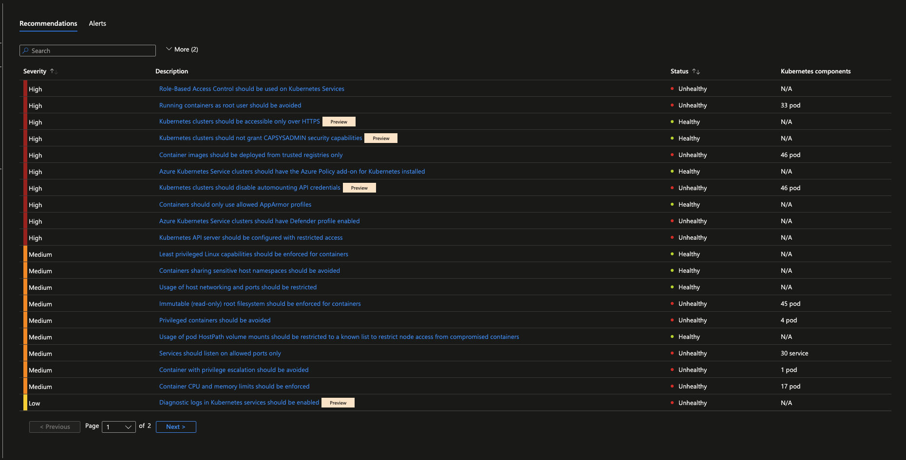
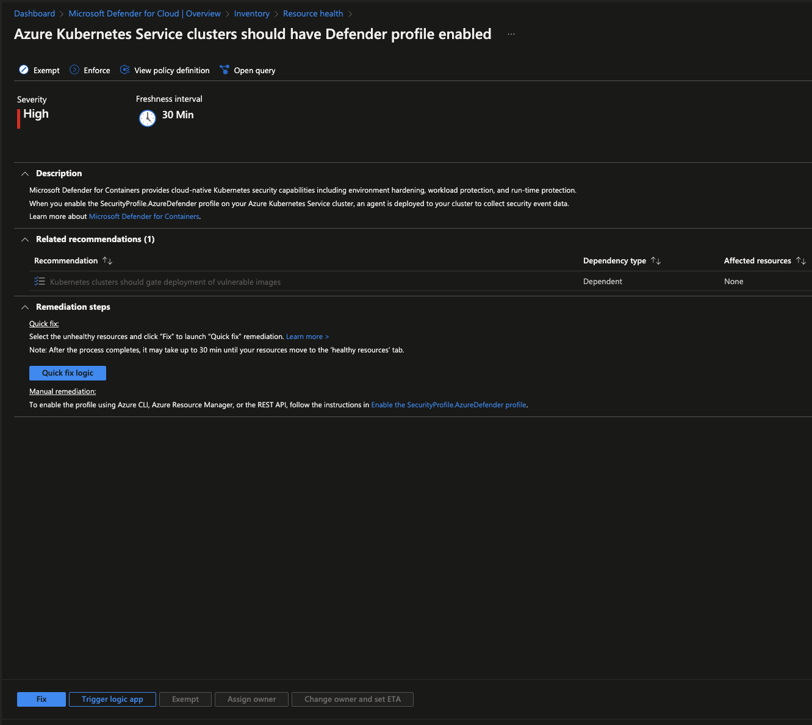

In today's world, security is a top priority for any organization or at least it should be. With the rise of cloud computing, the number of security threats has increased exponentially.

So how do we keep up? Where do we start?

Microsoft has created a set of security benchmarks to give users a starting point for setting up their security configurations. The Microsoft cloud security benchmark (MCSB) is the successor of Azure Security Benchmark (ASB), which was rebranded in October 2022 (Currently in public preview). 

In this post, I would like to go over the Azure security baseline for Azure Kubernetes Service and give a shoutout to two tools that can aid you in the process of establishing your compliance with the baseline.

## Azure Security Baseline for AKS

The Azure Security Baseline for [Azure Kubernetes Service](https://learn.microsoft.com/en-us/security/benchmark/azure/baselines/aks-security-baseline) (AKS) is a set of recommendations for securing your AKS cluster. 

It is an exhaustive list of various aspects of AKS security and it also provides the corresponding actions to be taken in each case. From the documentation's overview:

> _You can monitor this security baseline and its recommendations using Microsoft Defender for Cloud. Azure Policy definitions will be listed in the Regulatory Compliance section of the Microsoft Defender for Cloud dashboard._

> _When a section has relevant Azure Policy Definitions, they are listed in this baseline to help you measure compliance to the Azure Security Benchmark controls and recommendations. Some recommendations may require a paid Microsoft Defender plan to enable certain security scenarios._

It is based on the CIS Kubernetes Benchmark and the Azure Security Benchmark v1.0.

> _CIS Benchmarks are best practices for the secure configuration of a target system. Available for more than 100 CIS Benchmarks across 25+ vendor product families, CIS Benchmarks are developed through a unique consensus-based process comprised of cybersecurity professionals and subject matter experts around the world. CIS Benchmarks are the only consensus-based, best-practice security configuration guides both developed and accepted by government, business, industry, and academia._

For more information on **CIS Benchmark** please check [CIS Benchmark FAQ](https://www.cisecurity.org/cis-benchmarks/cis-benchmarks-faq).

For more information on the **CIS Benchmark for Kubernetes** please check the [kubernetes benchmark](https://www.cisecurity.org/benchmark/kubernetes). 

In the CIS Benchmark for Kubernetes document, there are instructions for both Master nodes and Worker nodes. But when using AKS we don't have access to the master nodes. In this case, we can make use of the [CIS Benchmark document for AKS](https://www.cisecurity.org/insights/blog/new-release-cis-azure-kubernetes-service-aks-benchmark).

**What could we use to help us check our AKS setup against this benchmark?**

We can start by looking at the Azure Portal and **Microsoft Defender for Cloud**, checking out CIS compliance with **Kube-bench** and any configuration mismatches with **Popeye**. I will go into more detail on the last two tools. But first, let's see what Microsoft Defender for Cloud looks like and what can you get from it.

## Microsoft Defender for Cloud

As suggested by Microsoft, we can start with Microsoft Defender for Cloud.
If you go to Azure Portal and search for Microsoft Defender for Cloud, then filter by "Assessed Resources", and select your cluster you will see a list of all the cluster details and _Recommendations_ and the _Alerts_ tab as well.



Let's take the first recommendation as an example:
_Azure Kubernetes Service clusters should have Defender profile enabled_

If you click on it and expand it will give you the following information:


You can choose to Exempt it, meaning you have either fixed this issue or you don't want to fix it or Enforce it, meaning you want to enforce this setting by adding it to an Azure Policy definition.

There is also a nice description of the issue and suggested remediation steps to take.


## Kube-bench

The official repository can be found [here](https://github.com/aquasecurity/kube-bench) with detailed installation instructions.

> _kube-bench is a tool that checks whether Kubernetes is deployed securely by running the checks documented in the CIS Kubernetes Benchmark._

There are multiple ways of running this tool that you can check [here](https://github.com/aquasecurity/kube-bench/blob/main/docs/running.md).

### Setting it up

To test out this tool, I decided to just apply it to my local cluster so the first thing I did was start my [minikube](https://minikube.sigs.k8s.io/docs/start/) instance and then I ran the following command:

```bash
> minikube start
😄  minikube v1.22.0 on Darwin 12.6.2
✨  Using the hyperkit driver based on existing profile
👍  Starting control plane node minikube in cluster minikube
🏃  Updating the running hyperkit "minikube" VM ...
🎉  minikube 1.28.0 is available! Download it: https://github.com/kubernetes/minikube/releases/tag/v1.28.0
💡  To disable this notice, run: 'minikube config set WantUpdateNotification false'

🐳  Preparing Kubernetes v1.21.2 on Docker 20.10.6 ...
🔎  Verifying Kubernetes components...
    ▪ Using image gcr.io/k8s-minikube/storage-provisioner:v5
🌟  Enabled addons: storage-provisioner, default-storageclass

❗  /usr/local/bin/kubectl is version 1.25.2, which may have incompatibilites with Kubernetes 1.21.2.
    ▪ Want kubectl v1.21.2? Try 'minikube kubectl -- get pods -A'
🏄  Done! kubectl is now configured to use "minikube" cluster and "default" namespace by default

# Download the job.yaml file
> curl https://raw.githubusercontent.com/aquasecurity/kube-bench/main/job.yaml > job.yaml

> kubectl apply -f job.yaml
job.batch/kube-bench created

> kubectl get pods -A                                                                                                                                ✔  at minikube ⎈ 
NAMESPACE       NAME                                        READY   STATUS              RESTARTS   AGE
default         kube-bench-t2fgh                            0/1     ContainerCreating   0          5s

> kubectl get pods -A                                                                                                                                ✔  at minikube ⎈
NAMESPACE       NAME                                        READY   STATUS      RESTARTS   AGE
default         kube-bench-t2fgh                            0/1     Completed   0          32s
```
You can run Kube-bench inside a pod, but it will need access to the host's PID namespace to check the running processes, as well as access to some directories on the host where config files and other files are stored.

The supplied `job.yaml` file can be applied to run the tests as a job. This was enough for me to run locally to get a feel of what the tool does and how it generates the report.

Next, after having run the tests, I wanted to get the report. The results of the tests can be found in the logs of the pod which you can get by running:

```bash
> kubectl logs kube-bench-t2fgh
```
Kube-bench generates a report that looks like the following:



```log
[INFO] 1 Master Node Security Configuration
[INFO] 1.1 Master Node Configuration Files
[PASS] 1.1.1 Ensure that the API server pod specification file permissions are set to 644 or more restrictive (Automated)
[PASS] 1.1.2 Ensure that the API server pod specification file ownership is set to root:root (Automated)
[PASS] 1.1.3 Ensure that the controller manager pod specification file permissions are set to 644 or more restrictive (Automated)
[PASS] 1.1.4 Ensure that the controller manager pod specification file ownership is set to root:root (Automated)
[PASS] 1.1.5 Ensure that the scheduler pod specification file permissions are set to 644 or more restrictive (Automated)
[PASS] 1.1.6 Ensure that the scheduler pod specification file ownership is set to root:root (Automated)
[PASS] 1.1.7 Ensure that the etcd pod specification file permissions are set to 644 or more restrictive (Automated)
[PASS] 1.1.8 Ensure that the etcd pod specification file ownership is set to root:root (Automated)
[WARN] 1.1.9 Ensure that the Container Network Interface file permissions are set to 644 or more restrictive (Manual)
[WARN] 1.1.10 Ensure that the Container Network Interface file ownership is set to root:root (Manual)
[FAIL] 1.1.11 Ensure that the etcd data directory permissions are set to 700 or more restrictive (Automated)
[FAIL] 1.1.12 Ensure that the etcd data directory ownership is set to etcd:etcd (Automated)
[PASS] 1.1.13 Ensure that the admin.conf file permissions are set to 644 or more restrictive (Automated)
[PASS] 1.1.14 Ensure that the admin.conf file ownership is set to root:root (Automated)
[PASS] 1.1.15 Ensure that the scheduler.conf file permissions are set to 644 or more restrictive (Automated)
[PASS] 1.1.16 Ensure that the scheduler.conf file ownership is set to root:root (Automated)
[PASS] 1.1.17 Ensure that the controller-manager.conf file permissions are set to 644 or more restrictive (Automated)
[PASS] 1.1.18 Ensure that the controller-manager.conf file ownership is set to root:root (Automated)
[FAIL] 1.1.19 Ensure that the Kubernetes PKI directory and file ownership is set to root:root (Automated)
[WARN] 1.1.20 Ensure that the Kubernetes PKI certificate file permissions are set to 644 or more restrictive (Manual)
[WARN] 1.1.21 Ensure that the Kubernetes PKI key file permissions are set to 600 (Manual)
[INFO] 1.2 API Server
[WARN] 1.2.1 Ensure that the --anonymous-auth argument is set to false (Manual)
[PASS] 1.2.2 Ensure that the --token-auth-file parameter is not set (Automated)
[PASS] 1.2.3 Ensure that the --kubelet-https argument is set to true (Automated)
[PASS] 1.2.4 Ensure that the --kubelet-client-certificate and --kubelet-client-key arguments are set as appropriate (Automated)
[FAIL] 1.2.5 Ensure that the --kubelet-certificate-authority argument is set as appropriate (Automated)
[PASS] 1.2.6 Ensure that the --authorization-mode argument is not set to AlwaysAllow (Automated)
[PASS] 1.2.7 Ensure that the --authorization-mode argument includes Node (Automated)
[PASS] 1.2.8 Ensure that the --authorization-mode argument includes RBAC (Automated)
[WARN] 1.2.9 Ensure that the admission control plugin EventRateLimit is set (Manual)
[PASS] 1.2.10 Ensure that the admission control plugin AlwaysAdmit is not set (Automated)
[WARN] 1.2.11 Ensure that the admission control plugin AlwaysPullImages is set (Manual)
[WARN] 1.2.12 Ensure that the admission control plugin SecurityContextDeny is set if PodSecurityPolicy is not used (Manual)
[PASS] 1.2.13 Ensure that the admission control plugin ServiceAccount is set (Automated)
[PASS] 1.2.14 Ensure that the admission control plugin NamespaceLifecycle is set (Automated)
[FAIL] 1.2.15 Ensure that the admission control plugin PodSecurityPolicy is set (Automated)
[PASS] 1.2.16 Ensure that the admission control plugin NodeRestriction is set (Automated)
[PASS] 1.2.17 Ensure that the --insecure-bind-address argument is not set (Automated)
[PASS] 1.2.18 Ensure that the --insecure-port argument is set to 0 (Automated)
[PASS] 1.2.19 Ensure that the --secure-port argument is not set to 0 (Automated)
[FAIL] 1.2.20 Ensure that the --profiling argument is set to false (Automated)
[FAIL] 1.2.21 Ensure that the --audit-log-path argument is set (Automated)
[FAIL] 1.2.22 Ensure that the --audit-log-maxage argument is set to 30 or as appropriate (Automated)
[FAIL] 1.2.23 Ensure that the --audit-log-maxbackup argument is set to 10 or as appropriate (Automated)
[FAIL] 1.2.24 Ensure that the --audit-log-maxsize argument is set to 100 or as appropriate (Automated)
[WARN] 1.2.25 Ensure that the --request-timeout argument is set as appropriate (Manual)
[PASS] 1.2.26 Ensure that the --service-account-lookup argument is set to true (Automated)
[PASS] 1.2.27 Ensure that the --service-account-key-file argument is set as appropriate (Automated)
[PASS] 1.2.28 Ensure that the --etcd-certfile and --etcd-keyfile arguments are set as appropriate (Automated)
[PASS] 1.2.29 Ensure that the --tls-cert-file and --tls-private-key-file arguments are set as appropriate (Automated)
[PASS] 1.2.30 Ensure that the --client-ca-file argument is set as appropriate (Automated)
[PASS] 1.2.31 Ensure that the --etcd-cafile argument is set as appropriate (Automated)
[WARN] 1.2.32 Ensure that the --encryption-provider-config argument is set as appropriate (Manual)
[WARN] 1.2.33 Ensure that encryption providers are appropriately configured (Manual)
[WARN] 1.2.34 Ensure that the API Server only makes use of Strong Cryptographic Ciphers (Manual)
[INFO] 1.3 Controller Manager
[WARN] 1.3.1 Ensure that the --terminated-pod-gc-threshold argument is set as appropriate (Manual)
[FAIL] 1.3.2 Ensure that the --profiling argument is set to false (Automated)
[PASS] 1.3.3 Ensure that the --use-service-account-credentials argument is set to true (Automated)
[PASS] 1.3.4 Ensure that the --service-account-private-key-file argument is set as appropriate (Automated)
[PASS] 1.3.5 Ensure that the --root-ca-file argument is set as appropriate (Automated)
[PASS] 1.3.6 Ensure that the RotateKubeletServerCertificate argument is set to true (Automated)
[PASS] 1.3.7 Ensure that the --bind-address argument is set to 127.0.0.1 (Automated)
[INFO] 1.4 Scheduler
[FAIL] 1.4.1 Ensure that the --profiling argument is set to false (Automated)
[PASS] 1.4.2 Ensure that the --bind-address argument is set to 127.0.0.1 (Automated)

== Remediations master ==
1.1.9 Run the below command (based on the file location on your system) on the master node.
For example,
chmod 644 <path/to/cni/files>

1.1.10 Run the below command (based on the file location on your system) on the master node.
For example,
chown root:root <path/to/cni/files>

1.1.11 On the etcd server node, get the etcd data directory, passed as an argument --data-dir,
from the below command:
ps -ef | grep etcd
Run the below command (based on the etcd data directory found above). For example,
chmod 700 /var/lib/etcd

1.1.12 On the etcd server node, get the etcd data directory, passed as an argument --data-dir,
from the below command:
ps -ef | grep etcd
Run the below command (based on the etcd data directory found above).
For example, chown etcd:etcd /var/lib/etcd

1.1.19 Run the below command (based on the file location on your system) on the master node.
For example,
chown -R root:root /etc/kubernetes/pki/

1.2.5 Follow the Kubernetes documentation and setup the TLS connection between
the apiserver and kubelets. Then, edit the API server pod specification file
/etc/kubernetes/manifests/kube-apiserver.yaml on the master node and set the
--kubelet-certificate-authority parameter to the path to the cert file for the certificate authority.
--kubelet-certificate-authority=<ca-string>

1.2.9 Follow the Kubernetes documentation and set the desired limits in a configuration file.
Then, edit the API server pod specification file /etc/kubernetes/manifests/kube-apiserver.yaml
and set the below parameters.
--enable-admission-plugins=...,EventRateLimit,...
--admission-control-config-file=<path/to/configuration/file>

1.2.11 Edit the API server pod specification file /etc/kubernetes/manifests/kube-apiserver.yaml
on the master node and set the --enable-admission-plugins parameter to include
AlwaysPullImages.
--enable-admission-plugins=...,AlwaysPullImages,...

1.2.12 Edit the API server pod specification file /etc/kubernetes/manifests/kube-apiserver.yaml
on the master node and set the --enable-admission-plugins parameter to include
SecurityContextDeny, unless PodSecurityPolicy is already in place.
--enable-admission-plugins=...,SecurityContextDeny,...

1.2.15 Follow the documentation and create Pod Security Policy objects as per your environment.
Then, edit the API server pod specification file /etc/kubernetes/manifests/kube-apiserver.yaml
on the master node and set the --enable-admission-plugins parameter to a
value that includes PodSecurityPolicy:
--enable-admission-plugins=...,PodSecurityPolicy,...
Then restart the API Server.

1.2.20 Edit the API server pod specification file /etc/kubernetes/manifests/kube-apiserver.yaml
on the master node and set the below parameter.
--profiling=false

1.2.21 Edit the API server pod specification file /etc/kubernetes/manifests/kube-apiserver.yaml
on the master node and set the --audit-log-path parameter to a suitable path and
file where you would like audit logs to be written, for example:
--audit-log-path=/var/log/apiserver/audit.log

1.2.22 Edit the API server pod specification file /etc/kubernetes/manifests/kube-apiserver.yaml
on the master node and set the --audit-log-maxage parameter to 30 or as an appropriate number of days:
--audit-log-maxage=30

1.2.23 Edit the API server pod specification file /etc/kubernetes/manifests/kube-apiserver.yaml
on the master node and set the --audit-log-maxbackup parameter to 10 or to an appropriate
value.
--audit-log-maxbackup=10

1.2.24 Edit the API server pod specification file /etc/kubernetes/manifests/kube-apiserver.yaml
on the master node and set the --audit-log-maxsize parameter to an appropriate size in MB.
For example, to set it as 100 MB:
--audit-log-maxsize=100

1.2.25 Edit the API server pod specification file /etc/kubernetes/manifests/kube-apiserver.yaml
and set the below parameter as appropriate and if needed.
For example,
--request-timeout=300s

1.2.32 Follow the Kubernetes documentation and configure a EncryptionConfig file.
Then, edit the API server pod specification file /etc/kubernetes/manifests/kube-apiserver.yaml
on the master node and set the --encryption-provider-config parameter to the path of that file: --encryption-provider-config=</path/to/EncryptionConfig/File>

1.2.33 Follow the Kubernetes documentation and configure a EncryptionConfig file.
In this file, choose aescbc, kms or secretbox as the encryption provider.

1.2.34 Edit the API server pod specification file /etc/kubernetes/manifests/kube-apiserver.yaml
on the master node and set the below parameter.
--tls-cipher-suites=TLS_ECDHE_ECDSA_WITH_AES_128_GCM_SHA256,TLS_ECDHE_RSA_WITH_AES_128_GCM
_SHA256,TLS_ECDHE_ECDSA_WITH_CHACHA20_POLY1305,TLS_ECDHE_RSA_WITH_AES_256_GCM
_SHA384,TLS_ECDHE_RSA_WITH_CHACHA20_POLY1305,TLS_ECDHE_ECDSA_WITH_AES_256_GCM
_SHA384

1.3.1 Edit the Controller Manager pod specification file /etc/kubernetes/manifests/kube-controller-manager.yaml
on the master node and set the --terminated-pod-gc-threshold to an appropriate threshold,
for example:
--terminated-pod-gc-threshold=10

1.3.2 Edit the Controller Manager pod specification file /etc/kubernetes/manifests/kube-controller-manager.yaml
on the master node and set the below parameter.
--profiling=false

1.4.1 Edit the Scheduler pod specification file /etc/kubernetes/manifests/kube-scheduler.yaml file
on the master node and set the below parameter.
--profiling=false


== Summary master ==
39 checks PASS
12 checks FAIL
13 checks WARN
0 checks INFO

[INFO] 2 Etcd Node Configuration
[INFO] 2 Etcd Node Configuration Files
[PASS] 2.1 Ensure that the --cert-file and --key-file arguments are set as appropriate (Automated)
[PASS] 2.2 Ensure that the --client-cert-auth argument is set to true (Automated)
[PASS] 2.3 Ensure that the --auto-tls argument is not set to true (Automated)
[PASS] 2.4 Ensure that the --peer-cert-file and --peer-key-file arguments are set as appropriate (Automated)
[PASS] 2.5 Ensure that the --peer-client-cert-auth argument is set to true (Automated)
[PASS] 2.6 Ensure that the --peer-auto-tls argument is not set to true (Automated)
[PASS] 2.7 Ensure that a unique Certificate Authority is used for etcd (Manual)

== Summary etcd ==
7 checks PASS
0 checks FAIL
0 checks WARN
0 checks INFO

[INFO] 3 Control Plane Configuration
[INFO] 3.1 Authentication and Authorization
[WARN] 3.1.1 Client certificate authentication should not be used for users (Manual)
[INFO] 3.2 Logging
[WARN] 3.2.1 Ensure that a minimal audit policy is created (Manual)
[WARN] 3.2.2 Ensure that the audit policy covers key security concerns (Manual)

== Remediations controlplane ==
3.1.1 Alternative mechanisms provided by Kubernetes such as the use of OIDC should be
implemented in place of client certificates.

3.2.1 Create an audit policy file for your cluster.

3.2.2 Consider modification of the audit policy in use on the cluster to include these items, at a
minimum.


== Summary controlplane ==
0 checks PASS
0 checks FAIL
3 checks WARN
0 checks INFO

[INFO] 4 Worker Node Security Configuration
[INFO] 4.1 Worker Node Configuration Files
[PASS] 4.1.1 Ensure that the kubelet service file permissions are set to 644 or more restrictive (Automated)
[PASS] 4.1.2 Ensure that the kubelet service file ownership is set to root:root (Automated)
[PASS] 4.1.3 If proxy kubeconfig file exists ensure permissions are set to 644 or more restrictive (Manual)
[PASS] 4.1.4 If proxy kubeconfig file exists ensure ownership is set to root:root (Manual)
[PASS] 4.1.5 Ensure that the --kubeconfig kubelet.conf file permissions are set to 644 or more restrictive (Automated)
[PASS] 4.1.6 Ensure that the --kubeconfig kubelet.conf file ownership is set to root:root (Automated)
[WARN] 4.1.7 Ensure that the certificate authorities file permissions are set to 644 or more restrictive (Manual)
[WARN] 4.1.8 Ensure that the client certificate authorities file ownership is set to root:root (Manual)
[PASS] 4.1.9 Ensure that the kubelet --config configuration file has permissions set to 644 or more restrictive (Automated)
[PASS] 4.1.10 Ensure that the kubelet --config configuration file ownership is set to root:root (Automated)
[INFO] 4.2 Kubelet
[PASS] 4.2.1 Ensure that the anonymous-auth argument is set to false (Automated)
[PASS] 4.2.2 Ensure that the --authorization-mode argument is not set to AlwaysAllow (Automated)
[PASS] 4.2.3 Ensure that the --client-ca-file argument is set as appropriate (Automated)
[PASS] 4.2.4 Ensure that the --read-only-port argument is set to 0 (Manual)
[PASS] 4.2.5 Ensure that the --streaming-connection-idle-timeout argument is not set to 0 (Manual)
[FAIL] 4.2.6 Ensure that the --protect-kernel-defaults argument is set to true (Automated)
[PASS] 4.2.7 Ensure that the --make-iptables-util-chains argument is set to true (Automated)
[WARN] 4.2.8 Ensure that the --hostname-override argument is not set (Manual)
[WARN] 4.2.9 Ensure that the --event-qps argument is set to 0 or a level which ensures appropriate event capture (Manual)
[WARN] 4.2.10 Ensure that the --tls-cert-file and --tls-private-key-file arguments are set as appropriate (Manual)
[PASS] 4.2.11 Ensure that the --rotate-certificates argument is not set to false (Automated)
[PASS] 4.2.12 Verify that the RotateKubeletServerCertificate argument is set to true (Manual)
[WARN] 4.2.13 Ensure that the Kubelet only makes use of Strong Cryptographic Ciphers (Manual)

== Remediations node ==
4.1.7 Run the following command to modify the file permissions of the
--client-ca-file chmod 644 <filename>

4.1.8 Run the following command to modify the ownership of the --client-ca-file.
chown root:root <filename>

4.2.6 If using a Kubelet config file, edit the file to set protectKernelDefaults: true.
If using command line arguments, edit the kubelet service file
/etc/systemd/system/kubelet.service.d/10-kubeadm.conf on each worker node and
set the below parameter in KUBELET_SYSTEM_PODS_ARGS variable.
--protect-kernel-defaults=true
Based on your system, restart the kubelet service. For example:
systemctl daemon-reload
systemctl restart kubelet.service

4.2.8 Edit the kubelet service file /etc/systemd/system/kubelet.service.d/10-kubeadm.conf
on each worker node and remove the --hostname-override argument from the
KUBELET_SYSTEM_PODS_ARGS variable.
Based on your system, restart the kubelet service. For example:
systemctl daemon-reload
systemctl restart kubelet.service

4.2.9 If using a Kubelet config file, edit the file to set eventRecordQPS: to an appropriate level.
If using command line arguments, edit the kubelet service file
/etc/systemd/system/kubelet.service.d/10-kubeadm.conf on each worker node and
set the below parameter in KUBELET_SYSTEM_PODS_ARGS variable.
Based on your system, restart the kubelet service. For example:
systemctl daemon-reload
systemctl restart kubelet.service

4.2.10 If using a Kubelet config file, edit the file to set tlsCertFile to the location
of the certificate file to use to identify this Kubelet, and tlsPrivateKeyFile
to the location of the corresponding private key file.
If using command line arguments, edit the kubelet service file
/etc/systemd/system/kubelet.service.d/10-kubeadm.conf on each worker node and
set the below parameters in KUBELET_CERTIFICATE_ARGS variable.
--tls-cert-file=<path/to/tls-certificate-file>
--tls-private-key-file=<path/to/tls-key-file>
Based on your system, restart the kubelet service. For example:
systemctl daemon-reload
systemctl restart kubelet.service

4.2.13 If using a Kubelet config file, edit the file to set TLSCipherSuites: to
TLS_ECDHE_ECDSA_WITH_AES_128_GCM_SHA256,TLS_ECDHE_RSA_WITH_AES_128_GCM_SHA256,TLS_ECDHE_ECDSA_WITH_CHACHA20_POLY1305,TLS_ECDHE_RSA_WITH_AES_256_GCM_SHA384,TLS_ECDHE_RSA_WITH_CHACHA20_POLY1305,TLS_ECDHE_ECDSA_WITH_AES_256_GCM_SHA384,TLS_RSA_WITH_AES_256_GCM_SHA384,TLS_RSA_WITH_AES_128_GCM_SHA256
or to a subset of these values.
If using executable arguments, edit the kubelet service file
/etc/systemd/system/kubelet.service.d/10-kubeadm.conf on each worker node and
set the --tls-cipher-suites parameter as follows, or to a subset of these values.
--tls-cipher-suites=TLS_ECDHE_ECDSA_WITH_AES_128_GCM_SHA256,TLS_ECDHE_RSA_WITH_AES_128_GCM_SHA256,TLS_ECDHE_ECDSA_WITH_CHACHA20_POLY1305,TLS_ECDHE_RSA_WITH_AES_256_GCM_SHA384,TLS_ECDHE_RSA_WITH_CHACHA20_POLY1305,TLS_ECDHE_ECDSA_WITH_AES_256_GCM_SHA384,TLS_RSA_WITH_AES_256_GCM_SHA384,TLS_RSA_WITH_AES_128_GCM_SHA256
Based on your system, restart the kubelet service. For example:
systemctl daemon-reload
systemctl restart kubelet.service


== Summary node ==
16 checks PASS
1 checks FAIL
6 checks WARN
0 checks INFO

[INFO] 5 Kubernetes Policies
[INFO] 5.1 RBAC and Service Accounts
[WARN] 5.1.1 Ensure that the cluster-admin role is only used where required (Manual)
[WARN] 5.1.2 Minimize access to secrets (Manual)
[WARN] 5.1.3 Minimize wildcard use in Roles and ClusterRoles (Manual)
[WARN] 5.1.4 Minimize access to create pods (Manual)
[WARN] 5.1.5 Ensure that default service accounts are not actively used. (Manual)
[WARN] 5.1.6 Ensure that Service Account Tokens are only mounted where necessary (Manual)
[WARN] 5.1.7 Avoid use of system:masters group (Manual)
[WARN] 5.1.8 Limit use of the Bind, Impersonate and Escalate permissions in the Kubernetes cluster (Manual)
[INFO] 5.2 Pod Security Policies
[WARN] 5.2.1 Minimize the admission of privileged containers (Automated)
[WARN] 5.2.2 Minimize the admission of containers wishing to share the host process ID namespace (Automated)
[WARN] 5.2.3 Minimize the admission of containers wishing to share the host IPC namespace (Automated)
[WARN] 5.2.4 Minimize the admission of containers wishing to share the host network namespace (Automated)
[WARN] 5.2.5 Minimize the admission of containers with allowPrivilegeEscalation (Automated)
[WARN] 5.2.6 Minimize the admission of root containers (Automated)
[WARN] 5.2.7 Minimize the admission of containers with the NET_RAW capability (Automated)
[WARN] 5.2.8 Minimize the admission of containers with added capabilities (Automated)
[WARN] 5.2.9 Minimize the admission of containers with capabilities assigned (Manual)
[INFO] 5.3 Network Policies and CNI
[WARN] 5.3.1 Ensure that the CNI in use supports Network Policies (Manual)
[WARN] 5.3.2 Ensure that all Namespaces have Network Policies defined (Manual)
[INFO] 5.4 Secrets Management
[WARN] 5.4.1 Prefer using secrets as files over secrets as environment variables (Manual)
[WARN] 5.4.2 Consider external secret storage (Manual)
[INFO] 5.5 Extensible Admission Control
[WARN] 5.5.1 Configure Image Provenance using ImagePolicyWebhook admission controller (Manual)
[INFO] 5.7 General Policies
[WARN] 5.7.1 Create administrative boundaries between resources using namespaces (Manual)
[WARN] 5.7.2 Ensure that the seccomp profile is set to docker/default in your pod definitions (Manual)
[WARN] 5.7.3 Apply Security Context to Your Pods and Containers (Manual)
[WARN] 5.7.4 The default namespace should not be used (Manual)

== Remediations policies ==
5.1.1 Identify all clusterrolebindings to the cluster-admin role. Check if they are used and
if they need this role or if they could use a role with fewer privileges.
Where possible, first bind users to a lower privileged role and then remove the
clusterrolebinding to the cluster-admin role :
kubectl delete clusterrolebinding [name]

5.1.2 Where possible, remove get, list and watch access to secret objects in the cluster.

5.1.3 Where possible replace any use of wildcards in clusterroles and roles with specific
objects or actions.

5.1.4 Where possible, remove create access to pod objects in the cluster.

5.1.5 Create explicit service accounts wherever a Kubernetes workload requires specific access
to the Kubernetes API server.
Modify the configuration of each default service account to include this value
automountServiceAccountToken: false

5.1.6 Modify the definition of pods and service accounts which do not need to mount service
account tokens to disable it.

5.1.7 Remove the system:masters group from all users in the cluster.

5.1.8 Where possible, remove the impersonate, bind and escalate rights from subjects.

5.2.1 Create a PSP as described in the Kubernetes documentation, ensuring that
the .spec.privileged field is omitted or set to false.

5.2.2 Create a PSP as described in the Kubernetes documentation, ensuring that the
.spec.hostPID field is omitted or set to false.

5.2.3 Create a PSP as described in the Kubernetes documentation, ensuring that the
.spec.hostIPC field is omitted or set to false.

5.2.4 Create a PSP as described in the Kubernetes documentation, ensuring that the
.spec.hostNetwork field is omitted or set to false.

5.2.5 Create a PSP as described in the Kubernetes documentation, ensuring that the
.spec.allowPrivilegeEscalation field is omitted or set to false.

5.2.6 Create a PSP as described in the Kubernetes documentation, ensuring that the
.spec.runAsUser.rule is set to either MustRunAsNonRoot or MustRunAs with the range of
UIDs not including 0.

5.2.7 Create a PSP as described in the Kubernetes documentation, ensuring that the
.spec.requiredDropCapabilities is set to include either NET_RAW or ALL.

5.2.8 Ensure that allowedCapabilities is not present in PSPs for the cluster unless
it is set to an empty array.

5.2.9 Review the use of capabilites in applications running on your cluster. Where a namespace
contains applicaions which do not require any Linux capabities to operate consider adding
a PSP which forbids the admission of containers which do not drop all capabilities.

5.3.1 If the CNI plugin in use does not support network policies, consideration should be given to
making use of a different plugin, or finding an alternate mechanism for restricting traffic
in the Kubernetes cluster.

5.3.2 Follow the documentation and create NetworkPolicy objects as you need them.

5.4.1 if possible, rewrite application code to read secrets from mounted secret files, rather than
from environment variables.

5.4.2 Refer to the secrets management options offered by your cloud provider or a third-party
secrets management solution.

5.5.1 Follow the Kubernetes documentation and setup image provenance.

5.7.1 Follow the documentation and create namespaces for objects in your deployment as you need
them.

5.7.2 Use security context to enable the docker/default seccomp profile in your pod definitions.
An example is as below:
  securityContext:
    seccompProfile:
      type: RuntimeDefault

5.7.3 Follow the Kubernetes documentation and apply security contexts to your pods. For a
suggested list of security contexts, you may refer to the CIS Security Benchmark for Docker
Containers.

5.7.4 Ensure that namespaces are created to allow for appropriate segregation of Kubernetes
resources and that all new resources are created in a specific namespace.


== Summary policies ==
0 checks PASS
0 checks FAIL
26 checks WARN
0 checks INFO

== Summary total ==
62 checks PASS
13 checks FAIL
48 checks WARN
0 checks INFO
```



This can also be run inside the AKS cluster by following the instructions [here](https://github.com/aquasecurity/kube-bench/blob/main/docs/running.md#running-in-an-aks-cluster).
As a reminder: Kube-bench cannot be run on AKS master nodes. It can only be run on worker nodes, this is not a limitation of Kube-bench but of AKS as mentioned before.

### The report breakdown

From the report above you can see that Kube-bench benchmarks 5 sections of your configurations which are the following:

- Control Plane Components
- Etcd
- Control Plane Configurations
- Worker Nodes
- Policies

Each section starts by describing which section it targets, the lines having the INFO tag. For example:
```log
[INFO] 5 Kubernetes Policies
[INFO] 5.1 RBAC and Service Accounts
```
Then it lists the checks that are performed for that section. Each check gets a PASS, FAIL or WARN status. For example:
```log
[WARN] 5.1.1 Ensure that the cluster-admin role is only used where required (Manual)
```
And after the tests run, it also suggests remediations for the check that got a WARN/FAIL status. For example:
```log
== Remediations policies ==
5.1.1 Identify all clusterrolebindings to the cluster-admin role. Check if they are used and
if they need this role or if they could use a role with fewer privileges.
Where possible, first bind users to a lower privileged role and then remove the
clusterrolebinding to the cluster-admin role :
kubectl delete clusterrolebinding [name]
```
And at the end you can find a summary of the section:
```log
== Summary policies ==
0 checks PASS
0 checks FAIL
26 checks WARN
0 checks INFO
```

### Potential use cases

By running it as a CronJon in your cluster, Kube-bench can help you identify potential security issues in your cluster. It is a great tool to have in your toolbox and it is very easy to use.
You can configure it to run on a schedule like every week or month and get a report on the security of your cluster, while also taking into account the specific CIS benchmark for your cloud provider. For example, you can set up and run the [job-aks.yaml](https://github.com/aquasecurity/kube-bench/blob/main/job-aks.yaml) file to run the tests on an AKS cluster.

## Popeye - A Kubernetes Cluster Sanitizer


The repository for the tool can be found [here](https://github.com/derailed/popeye).

This is a read-only utility that scans live Kubernetes clusters and reports potential issues with deployed resources and configurations.
What I liked about this tool is that it is very easy to install and use and it achieves what it promises: it reduces the cognitive overload one faces when operating a Kubernetes cluster in the wild.

### Setting it up

Popeye can be used standalone using the command line, using a [spinach.yml](https://github.com/derailed/popeye/blob/master/spinach/spinach_aks.yml) file or running directly in the cluster as a CronJob.

In this post, I will be using the command line option on a mac. So to install it I just ran:
    
```log
# Install popeye
> brew install derailed/popeye/popeye
# Check popeye version
> popeye version                                                                                                                   
 ___     ___ _____   _____                       K          .-'-.
| _ \___| _ \ __\ \ / / __|                       8     __|      `\
|  _/ _ \  _/ _| \ V /| _|                         s   `-,-`--._   `\
|_| \___/_| |___| |_| |___|                       []  .->'  a     `|-'
  Biffs`em and Buffs`em!                            `=/ (__/_       /
                                                      \_,    `    _)
                                                         `----;  |
Version:   0.10.1
Commit:    ae19897a4b5d3738a3e98179207759e45a53a64c
Date:      2022-06-28T14:46:13Z
Logs:      /var/folders/vp/l8dlq0gn3x71f3vk82shmzlm0000gn/T/popeye.log

# Connected to my AKS cluster
# Check the context I am using
> kubectl config current-context
# Run popeye
> popeye
```
### The report breakdown

The report will be printed to the console and it will look something like the following snippet below. I have removed some of the output for brevity and to give you an idea of the output format and the types of checks that are performed and the results.

The report is nicely split into sections and each section has a summary of the checks performed and the results. It ends with giving a grade to the cluster.

The color coding is also very helpful to quickly identify the issues:

| **Level** | **Icon** | **Jurassic** | **Color** | **Description** |
|---|:---:|:---:|:---:|:---:|
| Ok | ✅ | OK | Green | Happy! |
| Info | 🔊 | I | BlueGreen | FYI |
| Warn | 😱 | W | Yellow | Potential Issue |
| Error | 💥 | E | Red | Action required |


```bash
> popeye                                                                                                                                      

 ___     ___ _____   _____                                                      K          .-'-.
| _ \___| _ \ __\ \ / / __|                                                      8     __|      `\
|  _/ _ \  _/ _| \ V /| _|                                                        s   `-,-`--._   `\
|_| \___/_| |___| |_| |___|                                                      []  .->'  a     `|-'
  Biffs`em and Buffs`em!                                                          `=/ (__/_       /
                                                                                    \_,    `    _)
                                                                                       `----;  |


GENERAL [AKS-STAGING]
┅┅┅┅┅┅┅┅┅┅┅┅┅┅┅┅┅┅┅┅┅┅┅┅┅┅┅┅┅┅┅┅┅┅┅┅┅┅┅┅┅┅┅┅┅┅┅┅┅┅┅┅┅┅┅┅┅┅┅┅┅┅┅┅┅┅┅┅┅┅┅┅┅┅┅┅┅┅┅┅┅┅┅┅┅┅┅┅┅┅┅┅┅┅┅┅┅┅┅┅┅
  · Connectivity...................................................................................✅
  · MetricServer...................................................................................✅


CLUSTER (1 SCANNED)                                                          💥 0 😱 0 🔊 0 ✅ 1 100٪
┅┅┅┅┅┅┅┅┅┅┅┅┅┅┅┅┅┅┅┅┅┅┅┅┅┅┅┅┅┅┅┅┅┅┅┅┅┅┅┅┅┅┅┅┅┅┅┅┅┅┅┅┅┅┅┅┅┅┅┅┅┅┅┅┅┅┅┅┅┅┅┅┅┅┅┅┅┅┅┅┅┅┅┅┅┅┅┅┅┅┅┅┅┅┅┅┅┅┅┅┅
  · Version........................................................................................✅
    ✅ [POP-406] K8s version OK.


CLUSTERROLES (13 SCANNED)                                                   💥 0 😱 0 🔊 0 ✅ 13 100٪
┅┅┅┅┅┅┅┅┅┅┅┅┅┅┅┅┅┅┅┅┅┅┅┅┅┅┅┅┅┅┅┅┅┅┅┅┅┅┅┅┅┅┅┅┅┅┅┅┅┅┅┅┅┅┅┅┅┅┅┅┅┅┅┅┅┅┅┅┅┅┅┅┅┅┅┅┅┅┅┅┅┅┅┅┅┅┅┅┅┅┅┅┅┅┅┅┅┅┅┅┅
  · azure-policy-webhook-cluster-role..............................................................✅
  · dapr-operator-admin............................................................................✅
  · dashboard-reader...............................................................................✅
  · gatekeeper-manager-role........................................................................✅
  · grafana-agent..................................................................................✅
  · keda-operator..................................................................................✅
  · keda-operator-external-metrics-reader..........................................................✅
  · kong-kong......................................................................................✅
  · omsagent-reader................................................................................✅
  · policy-agent...................................................................................✅
  · system:coredns-autoscaler......................................................................✅
  · system:metrics-server..........................................................................✅
  · system:prometheus..............................................................................✅


CLUSTERROLEBINDINGS (19 SCANNED)                                             💥 0 😱 6 🔊 0 ✅ 13 68٪
┅┅┅┅┅┅┅┅┅┅┅┅┅┅┅┅┅┅┅┅┅┅┅┅┅┅┅┅┅┅┅┅┅┅┅┅┅┅┅┅┅┅┅┅┅┅┅┅┅┅┅┅┅┅┅┅┅┅┅┅┅┅┅┅┅┅┅┅┅┅┅┅┅┅┅┅┅┅┅┅┅┅┅┅┅┅┅┅┅┅┅┅┅┅┅┅┅┅┅┅┅
  · azure-policy-webhook-cluster-rolebinding.......................................................✅
  · dapr-operator..................................................................................✅
  · dapr-role-tokenreview-binding..................................................................😱
    😱 [POP-1300] References a ClusterRole (system:auth-delegator) which does not exist.
  · dashboard-reader-global........................................................................✅
  · gatekeeper-manager-rolebinding.................................................................✅
  · grafana-agent..................................................................................✅
  · keda-operator..................................................................................✅
  · keda-operator-hpa-controller-external-metrics..................................................✅
  · keda-operator-system-auth-delegator............................................................😱
    😱 [POP-1300] References a ClusterRole (system:auth-delegator) which does not exist.
  · kong-kong......................................................................................✅
  · kubelet-api-admin..............................................................................😱
    😱 [POP-1300] References a ClusterRole (system:kubelet-api-admin) which does not exist.
  · metrics-server:system:auth-delegator...........................................................😱
    😱 [POP-1300] References a ClusterRole (system:auth-delegator) which does not exist.
  · omsagentclusterrolebinding.....................................................................✅
  · policy-agent...................................................................................✅
  · replicaset-controller..........................................................................😱
    😱 [POP-1300] References a ClusterRole (system:controller:replicaset-controller) which does not
       exist.
  · system:coredns-autoscaler......................................................................✅
  · system:discovery...............................................................................😱
    😱 [POP-1300] References a ClusterRole (system:discovery) which does not exist.
  · system:metrics-server..........................................................................✅
  · system:prometheus..............................................................................✅


CONFIGMAPS (43 SCANNED)                                                     💥 0 😱 0 🔊 37 ✅ 6 100٪
┅┅┅┅┅┅┅┅┅┅┅┅┅┅┅┅┅┅┅┅┅┅┅┅┅┅┅┅┅┅┅┅┅┅┅┅┅┅┅┅┅┅┅┅┅┅┅┅┅┅┅┅┅┅┅┅┅┅┅┅┅┅┅┅┅┅┅┅┅┅┅┅┅┅┅┅┅┅┅┅┅┅┅┅┅┅┅┅┅┅┅┅┅┅┅┅┅┅┅┅┅
  · dapr-system/kube-root-ca.crt...................................................................🔊
    🔊 [POP-400] Used? Unable to locate resource reference.
  · dapr-system/operator.dapr.io...................................................................🔊
    🔊 [POP-400] Used? Unable to locate resource reference.
  · dapr-system/webhooks.dapr.io...................................................................🔊
    🔊 [POP-400] Used? Unable to locate resource reference.
  · default/kube-root-ca.crt.......................................................................🔊
    🔊 [POP-400] Used? Unable to locate resource reference.
(...)


DAEMONSETS (9 SCANNED)                                                        💥 0 😱 2 🔊 0 ✅ 7 77٪
┅┅┅┅┅┅┅┅┅┅┅┅┅┅┅┅┅┅┅┅┅┅┅┅┅┅┅┅┅┅┅┅┅┅┅┅┅┅┅┅┅┅┅┅┅┅┅┅┅┅┅┅┅┅┅┅┅┅┅┅┅┅┅┅┅┅┅┅┅┅┅┅┅┅┅┅┅┅┅┅┅┅┅┅┅┅┅┅┅┅┅┅┅┅┅┅┅┅┅┅┅
  · kube-system/azure-ip-masq-agent................................................................✅
  · kube-system/cloud-node-manager.................................................................✅
  · kube-system/cloud-node-manager-windows.........................................................✅
  · kube-system/csi-azuredisk-node.................................................................✅
  · kube-system/csi-azuredisk-node-win.............................................................✅
  · kube-system/csi-azurefile-node.................................................................✅
  · kube-system/csi-azurefile-node-win.............................................................✅
  · kube-system/kube-proxy.........................................................................😱
    🐳 kube-proxy
      😱 [POP-107] No resource limits defined.
    🐳 kube-proxy-bootstrap
      😱 [POP-107] No resource limits defined.
  · prometheus-agent/grafana-agent.................................................................😱
    🐳 agent
      😱 [POP-106] No resources requests/limits defined.


DEPLOYMENTS (29 SCANNED)                                                     💥 0 😱 4 🔊 3 ✅ 22 86٪
┅┅┅┅┅┅┅┅┅┅┅┅┅┅┅┅┅┅┅┅┅┅┅┅┅┅┅┅┅┅┅┅┅┅┅┅┅┅┅┅┅┅┅┅┅┅┅┅┅┅┅┅┅┅┅┅┅┅┅┅┅┅┅┅┅┅┅┅┅┅┅┅┅┅┅┅┅┅┅┅┅┅┅┅┅┅┅┅┅┅┅┅┅┅┅┅┅┅┅┅┅
  · dapr-system/dapr-dashboard.....................................................................🔊
    🐳 dapr-dashboard
      🔊 [POP-108] Unnamed port 8080.
  · dapr-system/dapr-operator......................................................................🔊
    🐳 dapr-operator
      🔊 [POP-108] Unnamed port 6500.
  · dapr-system/dapr-sentry........................................................................🔊
    🐳 dapr-sentry
      🔊 [POP-108] Unnamed port 50001.
  · dapr-system/dapr-sidecar-injector..............................................................✅
  · gatekeeper-system/gatekeeper-audit.............................................................✅
  · gatekeeper-system/gatekeeper-controller........................................................✅
  · keda-system/keda-operator......................................................................✅
  · keda-system/keda-operator-metrics-apiserver....................................................✅
  · kong/kong-kong.................................................................................😱
    🐳 ingress-controller
      😱 [POP-106] No resources requests/limits defined.
    🐳 proxy
      😱 [POP-106] No resources requests/limits defined.
  · kube-system/azure-policy.......................................................................✅
  · kube-system/azure-policy-webhook...............................................................✅
  · kube-system/coredns............................................................................✅
  · kube-system/coredns-autoscaler.................................................................✅
  · kube-system/konnectivity-agent.................................................................✅
  · kube-system/metrics-server.....................................................................✅
(...)


HORIZONTALPODAUTOSCALERS (4 SCANNED)                                          💥 0 😱 2 🔊 0 ✅ 2 50٪
┅┅┅┅┅┅┅┅┅┅┅┅┅┅┅┅┅┅┅┅┅┅┅┅┅┅┅┅┅┅┅┅┅┅┅┅┅┅┅┅┅┅┅┅┅┅┅┅┅┅┅┅┅┅┅┅┅┅┅┅┅┅┅┅┅┅┅┅┅┅┅┅┅┅┅┅┅┅┅┅┅┅┅┅┅┅┅┅┅┅┅┅┅┅┅┅┅┅┅┅┅
  · HPA............................................................................................😱
    😱 [POP-604] If ALL HPAs triggered, 11500m will match/exceed cluster CPU(4931m) capacity by
       6570m.
    😱 [POP-605] If ALL HPAs triggered, 14720Mi will match/exceed cluster memory(1523Mi) capacity by
       13196Mi.
  · my-service/keda-hpa-my-service.................................................................✅
  · my-service-2/keda-hpa-my-service-2.............................................................😱
    😱 [POP-602] Replicas (1/100) at burst will match/exceed cluster CPU(4931m) capacity by 5070m.
    😱 [POP-603] Replicas (1/100) at burst will match/exceed cluster memory(1523Mi) capacity by
       11276Mi.
(...)


INGRESSES (13 SCANNED)                                                      💥 0 😱 0 🔊 0 ✅ 13 100٪
┅┅┅┅┅┅┅┅┅┅┅┅┅┅┅┅┅┅┅┅┅┅┅┅┅┅┅┅┅┅┅┅┅┅┅┅┅┅┅┅┅┅┅┅┅┅┅┅┅┅┅┅┅┅┅┅┅┅┅┅┅┅┅┅┅┅┅┅┅┅┅┅┅┅┅┅┅┅┅┅┅┅┅┅┅┅┅┅┅┅┅┅┅┅┅┅┅┅┅┅┅
  · my-service/my-service..........................................................................✅
  · kong/kong-dapr.................................................................................✅
(...)


NAMESPACES (23 SCANNED)                                                     💥 0 😱 0 🔊 3 ✅ 20 100٪
┅┅┅┅┅┅┅┅┅┅┅┅┅┅┅┅┅┅┅┅┅┅┅┅┅┅┅┅┅┅┅┅┅┅┅┅┅┅┅┅┅┅┅┅┅┅┅┅┅┅┅┅┅┅┅┅┅┅┅┅┅┅┅┅┅┅┅┅┅┅┅┅┅┅┅┅┅┅┅┅┅┅┅┅┅┅┅┅┅┅┅┅┅┅┅┅┅┅┅┅┅
  · dapr-system....................................................................................✅
  · default........................................................................................🔊
    🔊 [POP-400] Used? Unable to locate resource reference.
  · gatekeeper-system..............................................................................✅
  · keda-system....................................................................................✅
  · kong...........................................................................................✅
  · kube-node-lease................................................................................🔊
    🔊 [POP-400] Used? Unable to locate resource reference.
  · kube-public....................................................................................🔊
    🔊 [POP-400] Used? Unable to locate resource reference.
  · kube-system....................................................................................✅
  · logstash.......................................................................................✅
  · prometheus-agent...............................................................................✅
(...)


NETWORKPOLICIES (2 SCANNED)                                                  💥 0 😱 0 🔊 0 ✅ 2 100٪
┅┅┅┅┅┅┅┅┅┅┅┅┅┅┅┅┅┅┅┅┅┅┅┅┅┅┅┅┅┅┅┅┅┅┅┅┅┅┅┅┅┅┅┅┅┅┅┅┅┅┅┅┅┅┅┅┅┅┅┅┅┅┅┅┅┅┅┅┅┅┅┅┅┅┅┅┅┅┅┅┅┅┅┅┅┅┅┅┅┅┅┅┅┅┅┅┅┅┅┅┅
  · kube-system/konnectivity-agent.................................................................✅
  · kube-system/tunnelfront........................................................................✅


NODES (3 SCANNED)                                                             💥 0 😱 2 🔊 0 ✅ 1 33٪
┅┅┅┅┅┅┅┅┅┅┅┅┅┅┅┅┅┅┅┅┅┅┅┅┅┅┅┅┅┅┅┅┅┅┅┅┅┅┅┅┅┅┅┅┅┅┅┅┅┅┅┅┅┅┅┅┅┅┅┅┅┅┅┅┅┅┅┅┅┅┅┅┅┅┅┅┅┅┅┅┅┅┅┅┅┅┅┅┅┅┅┅┅┅┅┅┅┅┅┅┅
  · aks-default-***-vmss000000.....................................................................😱
    😱 [POP-710] Memory threshold (80%) reached 83%.
  · aks-default-***-vmss000001.....................................................................😱
    😱 [POP-710] Memory threshold (80%) reached 105%.
  · aks-default-***-vmss00000a.....................................................................✅


PERSISTENTVOLUMES (3 SCANNED)                                                💥 0 😱 0 🔊 0 ✅ 3 100٪
┅┅┅┅┅┅┅┅┅┅┅┅┅┅┅┅┅┅┅┅┅┅┅┅┅┅┅┅┅┅┅┅┅┅┅┅┅┅┅┅┅┅┅┅┅┅┅┅┅┅┅┅┅┅┅┅┅┅┅┅┅┅┅┅┅┅┅┅┅┅┅┅┅┅┅┅┅┅┅┅┅┅┅┅┅┅┅┅┅┅┅┅┅┅┅┅┅┅┅┅┅
  · pvc-**.........................................................................................✅
  · pvc-**.........................................................................................✅
  · pvc-**.........................................................................................✅


PERSISTENTVOLUMECLAIMS (3 SCANNED)                                           💥 0 😱 0 🔊 0 ✅ 3 100٪
┅┅┅┅┅┅┅┅┅┅┅┅┅┅┅┅┅┅┅┅┅┅┅┅┅┅┅┅┅┅┅┅┅┅┅┅┅┅┅┅┅┅┅┅┅┅┅┅┅┅┅┅┅┅┅┅┅┅┅┅┅┅┅┅┅┅┅┅┅┅┅┅┅┅┅┅┅┅┅┅┅┅┅┅┅┅┅┅┅┅┅┅┅┅┅┅┅┅┅┅┅
  · dapr-system/raft-log-dapr-placement-server-0...................................................✅
  · dapr-system/raft-log-dapr-placement-server-1...................................................✅
  · dapr-system/raft-log-dapr-placement-server-2...................................................✅


PODS (72 SCANNED)                                                             💥 1 😱 71 🔊 0 ✅ 0 0٪
┅┅┅┅┅┅┅┅┅┅┅┅┅┅┅┅┅┅┅┅┅┅┅┅┅┅┅┅┅┅┅┅┅┅┅┅┅┅┅┅┅┅┅┅┅┅┅┅┅┅┅┅┅┅┅┅┅┅┅┅┅┅┅┅┅┅┅┅┅┅┅┅┅┅┅┅┅┅┅┅┅┅┅┅┅┅┅┅┅┅┅┅┅┅┅┅┅┅┅┅┅
  · dapr-system/dapr-dashboard-1-lq942.............................................................😱
    😱 [POP-301] Connects to API Server? ServiceAccount token is mounted.
    🐳 dapr-dashboard
      😱 [POP-102] No probes defined.
      🔊 [POP-108] Unnamed port 8080.
  · dapr-system/dapr-operator-1-chmmq..............................................................😱
    😱 [POP-301] Connects to API Server? ServiceAccount token is mounted.
    🐳 dapr-operator
      😱 [POP-205] Pod was restarted (17) times.
      🔊 [POP-105] Liveness probe uses a port#, prefer a named port.
      🔊 [POP-105] Readiness probe uses a port#, prefer a named port.
      🔊 [POP-108] Unnamed port 6500.
  · dapr-system/dapr-placement-server-0............................................................😱
    😱 [POP-301] Connects to API Server? ServiceAccount token is mounted.
    😱 [POP-302] Pod could be running as root user. Check SecurityContext/Image.
    🐳 dapr-placement-server
      🔊 [POP-105] Liveness probe uses a port#, prefer a named port.
      🔊 [POP-105] Readiness probe uses a port#, prefer a named port.
      😱 [POP-306] Container could be running as root user. Check SecurityContext/Image.
(...)


PODDISRUPTIONBUDGETS (8 SCANNED)                                              💥 0 😱 2 🔊 0 ✅ 6 75٪
┅┅┅┅┅┅┅┅┅┅┅┅┅┅┅┅┅┅┅┅┅┅┅┅┅┅┅┅┅┅┅┅┅┅┅┅┅┅┅┅┅┅┅┅┅┅┅┅┅┅┅┅┅┅┅┅┅┅┅┅┅┅┅┅┅┅┅┅┅┅┅┅┅┅┅┅┅┅┅┅┅┅┅┅┅┅┅┅┅┅┅┅┅┅┅┅┅┅┅┅┅
  · dapr-system/dapr-dashboard-disruption-budget...................................................✅
  · dapr-system/dapr-operator-disruption-budget....................................................✅
  · dapr-system/dapr-placement-server-disruption-budget............................................✅
  · dapr-system/dapr-sentry-budget.................................................................✅
  · dapr-system/dapr-sidecar-injector-disruption-budget............................................✅
  · kube-system/coredns-pdb........................................................................😱
    😱 [POP-403] Deprecated PodDisruptionBudget API group "policy/v1beta1". Use "policy/v1" instead.
  · kube-system/konnectivity-agent.................................................................😱
    😱 [POP-403] Deprecated PodDisruptionBudget API group "policy/v1beta1". Use "policy/v1" instead.
  · logstash/logstash-logstash-pdb.................................................................✅


PODSECURITYPOLICIES (0 SCANNED)                                              💥 0 😱 0 🔊 0 ✅ 0 100٪
┅┅┅┅┅┅┅┅┅┅┅┅┅┅┅┅┅┅┅┅┅┅┅┅┅┅┅┅┅┅┅┅┅┅┅┅┅┅┅┅┅┅┅┅┅┅┅┅┅┅┅┅┅┅┅┅┅┅┅┅┅┅┅┅┅┅┅┅┅┅┅┅┅┅┅┅┅┅┅┅┅┅┅┅┅┅┅┅┅┅┅┅┅┅┅┅┅┅┅┅┅
  · Nothing to report.


REPLICASETS (197 SCANNED)                                                  💥 0 😱 0 🔊 0 ✅ 197 100٪
┅┅┅┅┅┅┅┅┅┅┅┅┅┅┅┅┅┅┅┅┅┅┅┅┅┅┅┅┅┅┅┅┅┅┅┅┅┅┅┅┅┅┅┅┅┅┅┅┅┅┅┅┅┅┅┅┅┅┅┅┅┅┅┅┅┅┅┅┅┅┅┅┅┅┅┅┅┅┅┅┅┅┅┅┅┅┅┅┅┅┅┅┅┅┅┅┅┅┅┅┅
  · dapr-system/dapr-dashboard-1...................................................................✅
  · dapr-system/dapr-operator-1....................................................................✅
  · dapr-system/dapr-sentry-1......................................................................✅
  · dapr-system/dapr-sidecar-injector-1............................................................✅
  · keda-system/keda-operator-1....................................................................✅
  · keda-system/keda-operator-metrics-apiserver-1..................................................✅
(...)


ROLES (5 SCANNED)                                                            💥 0 😱 0 🔊 0 ✅ 5 100٪
┅┅┅┅┅┅┅┅┅┅┅┅┅┅┅┅┅┅┅┅┅┅┅┅┅┅┅┅┅┅┅┅┅┅┅┅┅┅┅┅┅┅┅┅┅┅┅┅┅┅┅┅┅┅┅┅┅┅┅┅┅┅┅┅┅┅┅┅┅┅┅┅┅┅┅┅┅┅┅┅┅┅┅┅┅┅┅┅┅┅┅┅┅┅┅┅┅┅┅┅┅
  · default/secret-reader..........................................................................✅
  · gatekeeper-system/gatekeeper-manager-role......................................................✅
  · kong/kong-kong.................................................................................✅
  · kube-system/azure-policy-webhook-role..........................................................✅
  · kube-system/policy-pod-agent...................................................................✅


ROLEBINDINGS (7 SCANNED)                                                      💥 0 😱 2 🔊 0 ✅ 5 71٪
┅┅┅┅┅┅┅┅┅┅┅┅┅┅┅┅┅┅┅┅┅┅┅┅┅┅┅┅┅┅┅┅┅┅┅┅┅┅┅┅┅┅┅┅┅┅┅┅┅┅┅┅┅┅┅┅┅┅┅┅┅┅┅┅┅┅┅┅┅┅┅┅┅┅┅┅┅┅┅┅┅┅┅┅┅┅┅┅┅┅┅┅┅┅┅┅┅┅┅┅┅
  · default/dapr-secret-reader.....................................................................✅
  · gatekeeper-system/gatekeeper-manager-rolebinding...............................................✅
  · kong/kong-kong.................................................................................✅
  · kube-system/azure-policy-webhook-rolebinding...................................................✅
  · kube-system/keda-operator-auth-reader..........................................................😱
    😱 [POP-1300] References a Role (kube-system/extension-apiserver-authentication-reader) which
       does not exist.
  · kube-system/metrics-server-auth-reader.........................................................😱
    😱 [POP-1300] References a Role (kube-system/extension-apiserver-authentication-reader) which
       does not exist.
  · kube-system/policy-pod-agent...................................................................✅


SECRETS (277 SCANNED)                                                     💥 0 😱 0 🔊 254 ✅ 23 100٪
┅┅┅┅┅┅┅┅┅┅┅┅┅┅┅┅┅┅┅┅┅┅┅┅┅┅┅┅┅┅┅┅┅┅┅┅┅┅┅┅┅┅┅┅┅┅┅┅┅┅┅┅┅┅┅┅┅┅┅┅┅┅┅┅┅┅┅┅┅┅┅┅┅┅┅┅┅┅┅┅┅┅┅┅┅┅┅┅┅┅┅┅┅┅┅┅┅┅┅┅┅
  · dapr-system/dapr-operator-token-tdnb4..........................................................🔊
    🔊 [POP-400] Used? Unable to locate resource reference.
  · dapr-system/dapr-sidecar-injector-cert.........................................................✅
  · dapr-system/dapr-trust-bundle..................................................................✅
(...)


SERVICES (35 SCANNED)                                                        💥 3 😱 17 🔊 7 ✅ 8 42٪
┅┅┅┅┅┅┅┅┅┅┅┅┅┅┅┅┅┅┅┅┅┅┅┅┅┅┅┅┅┅┅┅┅┅┅┅┅┅┅┅┅┅┅┅┅┅┅┅┅┅┅┅┅┅┅┅┅┅┅┅┅┅┅┅┅┅┅┅┅┅┅┅┅┅┅┅┅┅┅┅┅┅┅┅┅┅┅┅┅┅┅┅┅┅┅┅┅┅┅┅┅
  · dapr-system/dapr-api...........................................................................🔊
    🔊 [POP-1102] Use of target port #6500 for service port TCP::80. Prefer named port.
  · dapr-system/dapr-dashboard.....................................................................😱
    🔊 [POP-1102] Use of target port #8080 for service port TCP::8080. Prefer named port.
    😱 [POP-1109] Only one Pod associated with this endpoint.
  · dapr-system/dapr-placement-server..............................................................🔊
    🔊 [POP-1102] Use of target port #50005 for service port TCP:api:50005. Prefer named port.
    🔊 [POP-1102] Use of target port #8201 for service port TCP:raft-node:8201. Prefer named port.
  · dapr-system/dapr-sentry........................................................................🔊
    🔊 [POP-1102] Use of target port #50001 for service port TCP::80. Prefer named port.
  · dapr-system/dapr-sidecar-injector..............................................................✅
  · dapr-system/dapr-webhook.......................................................................💥
    💥 [POP-1106] No target ports match service port TCP::443.
  · default/dapr-eventgrid-func-dapr...............................................................💥
    💥 [POP-1100] No pods match service selector.
    💥 [POP-1105] No associated endpoints.
  · default/kubernetes.............................................................................✅
(...)


SERVICEACCOUNTS (38 SCANNED)                                                 💥 0 😱 1 🔊 8 ✅ 29 97٪
┅┅┅┅┅┅┅┅┅┅┅┅┅┅┅┅┅┅┅┅┅┅┅┅┅┅┅┅┅┅┅┅┅┅┅┅┅┅┅┅┅┅┅┅┅┅┅┅┅┅┅┅┅┅┅┅┅┅┅┅┅┅┅┅┅┅┅┅┅┅┅┅┅┅┅┅┅┅┅┅┅┅┅┅┅┅┅┅┅┅┅┅┅┅┅┅┅┅┅┅┅
  · dapr-system/dapr-operator......................................................................✅
  · dapr-system/dashboard-reader...................................................................✅
  · dapr-system/default............................................................................🔊
    🔊 [POP-400] Used? Unable to locate resource reference.
  · default/default................................................................................🔊
    🔊 [POP-400] Used? Unable to locate resource reference.
  · domain-event-emitter/default...................................................................✅
  · domain-start/default...........................................................................✅
  · gatekeeper-system/default......................................................................🔊
    🔊 [POP-400] Used? Unable to locate resource reference.
  · gatekeeper-system/gatekeeper-admin.............................................................✅
(...)


STATEFULSETS (2 SCANNED)                                                     💥 0 😱 0 🔊 0 ✅ 2 100٪
┅┅┅┅┅┅┅┅┅┅┅┅┅┅┅┅┅┅┅┅┅┅┅┅┅┅┅┅┅┅┅┅┅┅┅┅┅┅┅┅┅┅┅┅┅┅┅┅┅┅┅┅┅┅┅┅┅┅┅┅┅┅┅┅┅┅┅┅┅┅┅┅┅┅┅┅┅┅┅┅┅┅┅┅┅┅┅┅┅┅┅┅┅┅┅┅┅┅┅┅┅
  · dapr-system/dapr-placement-server..............................................................✅
  · logstash/logstash-logstash.....................................................................✅


SUMMARY
┅┅┅┅┅┅┅┅┅┅┅┅┅┅┅┅┅┅┅┅┅┅┅┅┅┅┅┅┅┅┅┅┅┅┅┅┅┅┅┅┅┅┅┅┅┅┅┅┅┅┅┅┅┅┅┅┅┅┅┅┅┅┅┅┅┅┅┅┅┅┅┅┅┅┅┅┅┅┅┅┅┅┅┅┅┅┅┅┅┅┅┅┅┅┅┅┅┅┅┅┅
Your cluster score: 82 -- B
                                                                                o          .-'-.
                                                                                 o     __| B    `\
                                                                                  o   `-,-`--._   `\
                                                                                 []  .->'  a     `|-'
                                                                                  `=/ (__/_       /
                                                                                    \_,    `    _)
                                                                                       `----;  |
```


Popeye has a bit of a different scope than Kube-bench in the sense that it scans your cluster for best practices and potential issues. It is not a security scanner like Kube-bench, but it can be used to find potential security issues and for your cluster management.

It targets the following:
- nodes
- namespaces
- pods
- services

Its main scope is to find misconfigurations like port mismatches, dead or unused resources etc. You can find the full list of available sanitizers [here](https://github.com/derailed/popeye#sanitizers).

### Potential use cases
Should you choose it to run in a pipeline or as a job you can build on it and make action items to fix based on the errors reported in the report.

Or this could just be a little helpful tool to run on your cluster to get a quick overview of the state of your cluster. And you can extract any action items for yourself. In this case, you can save the report using the `--save` flag and attach it to your JIRA Ticket or PR.

This will save the report in your current working directory.
```bash
> popeye --save                                                                                                                    
/var/folders/vp/l8dlq0gn3x71f3vk82shmzlm0000gn/T/popeye/sanitizer_aks-staging_1673563387070145000.txt
```

## Summary
I quite enjoyed using both Popeye and Kube-bench. They are both very useful in different ways. Popeye is more of a cluster management tool, while Kube-bench is more of a security scanner. But they can both be used to improve the security of your cluster.

In the next posts from this series, we will take a deeper look at the reports in more detail, focusing on the errors and seeing what we can do to improve our cluster score.

_Until then, thank you for reading and I hope you found this useful. Let me know what other tools you use_
